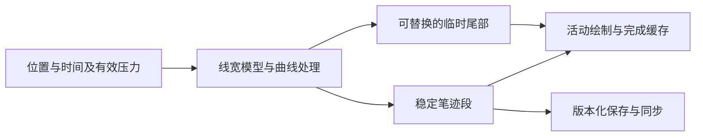

# 中文书写与签字栏笔迹方案选型研究

> 2026-09-13 后续决策：自研仿 PPT 钢笔作为未来可能的开发项记录。当前采用方向是继续深度优化 perfect-freehand，优先改善低端机器的跟手体验，并补齐压力信息。本报告的跨库对照保留为研究资料，当前不启动换包或自研引擎。开发记录见[PF 跟随与压力增量](classroom-pf-pressure-development-20260913.md)。

## 选型结论

课堂书写的体验目标是接近 Office PPT「绘图」选项卡中的钢笔／铅笔，并吸收签字栏中圆润、自然、有粗细变化的书写感。验收重点包括中文短笔画、横折与钩、起收笔、连续书写时的笔尖跟随，以及保存和重放后笔形的一致性。Office 的钢笔、铅笔纹理及支持设备上的倾斜效果属于不同笔刷能力，应分别评价。[^1]

建议把轻量签名方案提升到首轮对照：以 **signature_pad 为签名风格基准**，以 **smooth-signature 为中文笔锋参考**，以 **Atrament 为真实压力与轻量绘制参考**，同时保留当前 perfect-freehand 作为已有基线。首轮的目的在于确定更适合课堂汉字的笔形与输入方式；接入正式课堂前，各候选仍需满足短点完整、末点跟随、掌擦隔离和持久重放等合同。

Wacom WILL 保留为完整数字墨迹 SDK 候选；Google Ink Stroke Modeler 及其 TypeScript 社区移植保留为轨迹建模与预测方向。当前证据不足以将专业 SDK、原生框架或某种绘制技术判定为现场手感最好的方案，也不足以确认更换 PF 能消除大屏持续拖后。

签字栏参考尚未定位到具体 App、设备和输入工具，因此不能推断其采用了哪个库。原生 App 内既可能使用 WebView 加 Canvas，也可能调用平台原生墨迹；“感觉像原生”本身不决定实现路线。

## 签字栏提供的关键启发

### 速度模拟能够形成自然笔锋

Square 在 2012 年公开的 Android 签名实现结合了曲线插值、带时间戳的速度估计、连续变化的线宽和位图缓存。该团队当时认为触摸压力不够稳定，使用速度产生粗细变化，并将已完成曲线缓存，减少重复绘制。它是有明确产品背景的历史实现说明，不代表今天全部 Square 客户端的内部实现。[^2]

这条路线与没有有效压感的触摸屏相关：硬件压力不是产生漂亮字迹的唯一输入。对 Mathin 的建议是同时保留两种来源：有效压感设备使用真实压力；普通触摸、鼠标或压力恒定的笔使用带时间信息的运动模型。两条路径共享笔宽限制和连续性控制，具体映射由中文试写决定。

### 自然感包含多个独立维度

| 维度 | 中文书写中的观察点 | 选型含义 |
| --- | --- | --- |
| 位置跟随 | 笔尖与可见末端是否持续分离，快写间距是否扩大 | 输入新鲜度、曲线末端处理、调度和呈现一起评价 |
| 曲线与转折 | 横折是否被抹圆，竖钩是否缩短，撇捺是否出现鼓包 | 平滑强度和转角处理需要分别控制 |
| 粗细连续 | 轻重、快慢改变时，线宽是否自然过渡 | 真实压力、速度模拟、笔尖形状是不同候选 |
| 起收笔 | 点能否立即出现，短划是否完整，抬笔是否跳变 | 签名长曲线演示不足以覆盖中文短笔画 |
| 持续稳定 | 多写几行、长笔、大小窗口、缩放后表现是否一致 | 小签字框中的表现需要扩展到课堂画布验证 |
| 保存保真 | 预览、保存、重放、远端收到后的形状是否一致 | 图像导出之外还需要可重放的笔迹数据 |

这是一套产品评价框架，不是现有候选的实测排名。圆润的字形可以改善主观手感；减少几何滞后、降低实际显示延迟和改善字形，各自需要证据。

## 候选范围与初步优先级

下表的优先级表示下一步试验价值。未给出主观手感分数、实测延迟排名或未经核对的采购价格。

| 类型 | 方案 | 主要能力 | 当前判断 |
| --- | --- | --- | --- |
| 签名库 | signature_pad | 速度控制线宽、三次 Bézier、逐段绘制、点组导入导出 | 首轮签名风格基准；需核对末段和输入节流 |
| 中文签名库 | smooth-signature | 速度笔锋、二次曲线与梯形衔接、撤销重做 | 首轮笔形参考；原版起收笔与 Windows 入口需要适配 |
| 轻量绘图笔迹 | Atrament | 真实压力、模拟粗细、位置与压力平滑、程序化绘制 | 首轮压力参考；末端滞后及回放参数需要验证 |
| 历史签名库 | jSignature | 转角相关曲线拟合、方向性笔锋、矢量点组 | 借鉴曲线与笔尖设计；直接迁移优先级较低 |
| 轮廓算法 | perfect-freehand | 真实／模拟压力、轮廓点、笔锋参数 | 保留为现有基线；不作为必须保留的依赖 |
| 完整白板 | tldraw／Excalidraw | 场景、输入、笔迹、编辑与缓存的组合 | 借鉴局部实现；整体迁移属于更大范围改造 |
| 轨迹模型 | Google Ink Stroke Modeler | 带时间输入、平滑、笔状态建模、临时预测 | 长期算法参考；本身不完成浏览器笔刷绘制 |
| 社区移植 | ink-stroke-modeler-ts | 上述模型的 TypeScript 实现 | 实验候选；不是 Google 维护的正式 Web SDK |
| 原生墨迹核心 | Google Ink／Android Ink API | 网格笔迹、笔刷效果、Android 低延迟绘制 | 原生架构参考；当前不是可直接替换的 Web 包 |
| 专业墨迹 SDK | Wacom WILL for ink Web | 增量路径、预测、矢量／粒子笔刷、数据模型 | 完整引擎候选；先验证体验收益和部署条件 |
| 签名采集 SDK | Wacom Signature SDK JS | 签名采集、签名对象、专用签字设备接入 | 与 WILL for ink 分开评价；签名业务能力并非本次首要需求 |
| 交互识别 SDK | MyScript iink | 墨迹采集与渲染、文字／数学等识别 | 将来增加识别时再提高优先级 |
| Windows 原生 | Windows Ink／InkPresenter | 低延迟活动墨迹与完成墨迹交接 | Windows 客户端方向；浏览器无法直接当作 npm 笔刷调用 |
| Apple 原生 | PencilKit | 系统笔刷、低延迟采集、原生笔迹对象 | Apple App 参考；不直接适用于 Windows Chrome／Edge |
| 通用画布 | Fabric PencilBrush 等 | 路径绘制、对象编辑、画布管理 | 可作渲染基础；仍需设计目标笔锋 |
| 绘图组件 | react-canvas-draw | React 画布、平滑交互 | 仓库已归档，不列入本轮首选 |

各行的来源和版本边界见下文。React、Vue 或 React Native 包名有时只是同一底层算法的封装，不能按包的数量视为独立笔迹引擎。

## 轻量签名路线

### signature_pad：应重新进入首轮对照

signature_pad 的官方说明明确采用可变宽 Bézier 曲线，并引用 Square 的签名文章。它提供点组导出与导入、单点绘制，以及多种图像／SVG 输出。其适合本轮的价值在于提供一个容易隔离比较、具有明确签名风格的现成基准。[^3]

固定源码中的线宽计算使用两点速度和速度滤波，输出宽度再沿曲线变化。虽然采集的数据包含 `pressure`，当前 `_calculateCurveWidths` 和 `_strokeWidth` 没有直接用压力决定线宽；“保存了 pressure 字段”与“笔刷响应真实压力”需要区别。它的默认签名风格适合测试无压感输入，并不等于已经具备 PPT 式压力映射。[^4]

需要单独评价末端。当前 Bézier 由四点构建，曲线连接中间两点，最新点参与控制后方曲线；关闭节流后，这种后续点依赖仍然存在。该事实是曲线几何的源码结论，不能直接换算为某个固定毫秒数的上屏延迟。[^5]

默认 `throttle=16` 与 `minDistance=5` 都可调整。历史变更说明也明确承认点距筛选改善慢写质量，同时带来少量滞后。因此，应比较原生默认值与适合课堂的参数，并继续检查曲线尾部；仅凭两个默认值就排除该库，会忽略笔形质量和可调空间。[^3][^6]

维护记录对 Windows 大屏有直接参考价值：2025 年 Surface／Edge 的笔与手掌混用问题涉及不同 pointer type 都可能是 primary，维护者转向指针标识隔离，5.0.9 发布修复；输入取消后无法继续书写的问题于 5.1.2 修复。它们是已发布的历史修复，不应作为当前版本仍存在同一故障的证据。[^7]

**建议用途：**作为第一轮可运行的签名笔形基准。课堂接入评估还应覆盖有效压力支路、最新点临时尾迹、合并样本的时间戳、单笔撤销、整笔擦除和保存重放。

### smooth-signature：中文笔锋值得比较，原版不宜直接接管课堂输入

该项目面向带笔锋的 H5 手写签名，提供中文手写演示。它按距离除以时间估计速度，通过最小／最大线宽与宽度变化上限控制笔锋，使用二次曲线和梯形填充连接宽度不同的片段。作者对其他签名库锯齿的评价属于其开发动机，不构成独立的质量排名。[^8]

固定源码显示，原版根据移动端判断选择 touch 或 mouse 监听，没有采用统一的 Pointer Events 入口。采样使用 `Date.now()`，同一毫秒的新点直接忽略，每次移动各自安排一次 RAF；这些做法需要与课堂已有的笔、触摸、掌擦和合批输入重新协调。[^9]

更重要的是短笔画和末端处理。对固定版本的输入方法进行合成调用，以记录 Canvas 绘制命令的替身检查控制流，得到以下结果。输入每次间隔 10 ms，横向间距 10 CSS px，`scale=1`，开启默认笔锋；每个用例都执行全部已排队绘制回调再收笔。

| 输入点列 | 起笔时绘制次数 | 收笔前／后的 stroke 或 fill 次数 | 最后曲线端点 |
| --- | ---: | ---: | --- |
| (10,10) | 0 | 0／0 | 无 |
| (10,10) → (20,10) | 0 | 0／0 | 无 |
| 再增加 (30,10) | 0 | 1／1 | (23,10) |
| 再增加 (40,10) | 0 | 3／3 | (33,10) |

这些结果说明该原版路径中单点与仅两点短划没有发出显色命令，收笔也没有补到最后输入点。端点列表示曲线几何位置，不包括线宽覆盖范围，更不是实际设备的显示延迟。上述行为与 `onDrawStart`、`drawSmoothLine`、`onDrawEnd` 的源码一致。[^9]

社区 #14 报告特定平板上有延迟、不连笔时漏笔画；#17 报告 Windows 11 Chrome 触屏入口问题；#23 报告缩放条件下的坐标偏移。它们是版本和设备不完整的历史报告，其中缩放问题尚未给出确定根因；应将其转化为试验项目，而非外推为所有设备必现。[^10]

**建议用途：**比较其中文笔锋风格，必要时借鉴宽度连续和曲线连接算法。候选版本需补齐起笔显色、短点短划、收笔末端、取消、RAF 生命周期及 Pointer Events 接入后，再进入课堂验收。

### Atrament：真实压力与轻量实时绘制的参考

Atrament 同时提供模拟线宽、真实压力映射和压力平滑。其默认定位是直接向 Canvas 位图绘制；需要回放时可启用笔迹记录，也有程序化绘制接口。官方文档同时说明：增加位置平滑会改善圆润度，降低该值会改善响应感。[^11]

源码中的位置采用逐次逼近，处理后的点会成为下一次绘制的参照点。这样可以减少抖动，也会产生几何跟随偏移；它没有因为使用 Canvas 原生曲线就自动摆脱平滑滞后。记录模式会保存位置、相对时间及压力；回放时还需保持线宽、平滑和压力映射配置一致。[^12]

启用 `adaptiveStroke` 时，压力值等于 `0.5` 会进入模拟宽度分支。这是一种实现约定，不足以严格判断设备是否具有真实压感。Mathin 如借鉴该方案，建议在输入层明确设备和压力来源，避免以单个数值代替能力判断。[^12]

历史 #83 报告 Windows Chrome 打开开发者工具前后的平滑手感不同；维护者提出可能与输入频率有关，但未复现并确认根因。新版发行说明则明确记录了压力映射与压力数据重放的改进。两者共同提示应固定输入和运行条件，并查看当前版本合同。[^13]

**建议用途：**第三个轻量候选，重点比较真实压力下的中文笔画、低平滑配置和直接绘制成本。默认笔形、末点、掌擦及持久回放仍需要专门验收。

### jSignature：值得保留的方向性笔尖思路

jSignature 的设计说明提出按转角调整 Bézier 控制柄，并保留末尾少量曲线用于实时调整；它还描述用固定倾斜的非对称笔尖，让线宽随行笔方向变化。这提供了真实压力和速度模拟之外的笔锋来源，可作为硬笔风格试验的参考。其“无感知延迟”等表述是项目作者的经验性说明，缺少本设备的受控计时。[^14]

固定源码仍具有 jQuery 和历史浏览器适配结构，并通过短定时器分发笔迹绘制回调。方向性笔锋的具体启用路径也需要检查，不能仅凭介绍页面推断所有配置都开启。npm 发布版本较老，因而更适合提取设计思路，而不是优先迁入整套签字组件。[^15]

## 轮廓算法、轨迹模型与完整白板

### perfect-freehand、tldraw 与 Excalidraw

PF 提供的是输入点到笔画轮廓的转换，支持真实压力和模拟压力；事件采集、绘制调度、预测尾迹和 Canvas 呈现由应用负责。当前 Mathin 还会在每次活动绘制中重算整笔，这属于集成策略的一部分。PF 可以继续作为基线，但选型应允许替换轮廓生成方式。[^16]

PF #58 中的快速转向“肘部”是作者确认过的笔形问题，作者也提到 tldraw 分支的改进。它支持针对中文转折进行比较，尚不足以证明 PF 普遍不适合汉字，或这些改进已经在当前 npm 版本中全部实现。[^17]

固定版本的 Excalidraw 继续使用 PF，并区分真实／模拟压力；tldraw 使用演进后的同源算法及自己的输入管理。完整白板的手感来自输入、算法、活动绘制与场景缓存的组合。Mathin 已有课件、主副板书、同步和擦除流程，整体替换白板 SDK 的范围明显大于引入一支新笔刷。[^18]

### Google Ink Stroke Modeler 与 TypeScript 社区移植

Google Ink Stroke Modeler 接收位置、时间和可选笔状态，以增量方式输出平滑轨迹，并能生成临时预测。正式输出保持稳定，预测在新输入到达后失效；文档也明确承认模型会落后原始输入，需要预测补偿。模型偏重平滑的手写曲线，中文横折、钩和小圈是否保形仍需验证。[^19]

TypeScript 移植 `WhiteboardCX/ink-stroke-modeler-ts` 提供调用方复用缓冲区、状态保存恢复和两类预测，仓库声明版本为 0.1.0，按 GitHub 依赖方式发布。Google 官方仓库将其列为相关项目，同时明确它并非 Google 维护。社区项目声明移植了上游测试，这不等于已经独立确认移植完整性和现场稳定性。[^20]

它的输出是建模后的轨迹，应用仍需实现线宽、轮廓、绘制及正式／临时部分的交接。若签名曲线方案无法兼顾稳笔与低滞后，这条路线有进一步实验价值；当前更适合隔离原型。

### Google Ink 与 Android Ink API

Google Ink 是更完整的笔迹生成库，提供网格形式的笔迹与笔刷效果，构成 Android Jetpack Ink 的核心。当前公开说明没有对接口稳定性作强保证，现有 rendering 模块主要面向 Android 的 Mesh；不能把它视为现成的浏览器墨迹包。官方还明确说明它已经从旧 Stroke Modeler 迁移到更新的平滑实现，两个仓库不是当前完全相同的算法。[^19][^21]

Android Ink API 将输入处理和低延迟绘制进一步整合。其价值在于展示原生实现如何组合笔刷、输入和呈现，而非证明这些收益可以通过一个 JavaScript 替换直接复制到 Windows 浏览器。[^22]

## 专业 SDK 与原生路径

### Wacom WILL for ink Web

WILL 的管线提供新增笔迹段和临时预测部分，覆盖矢量笔刷、粒子笔刷与相应渲染方式。它在架构上接近完整数字墨迹引擎，适合进一步评价钢笔与铅笔类效果；Web API 还包含不同 Canvas 渲染器及异步构建能力，不能把“支持 WebGL”简化为只能用 WebGL 或必然更快。[^23][^24]

官方 Ink Designer 展示矢量／粒子配置、速度与宽度映射、起收笔和纹理选项，可用于了解能力范围。该页面包含历史浏览器提示和特定采样率下的默认参数；示例配置不宜不加区分地移入当前 Chrome／Edge。[^25]

官方资料列出 Web SDK 2.0.0，并说明本机使用无需许可证；同时存在独立 License Manager。该说明不足以确定 Mathin 的局域网、多域名及正式站点部署授权，也没有在本轮核定适用报价。选型时需要把可用 SDK、部署条件和成本作为明确项，不能因为演示可用就推断正式发布条件已经满足。[^26]

**建议用途：**第二层完整引擎候选。只有在轻量方案无法满足笔形、预测、纹理等要求，或维护成本更高时，再扩大 SDK 集成评估；能力覆盖面不替代实际试写结果。

### Wacom Signature SDK 与 MyScript iink

Wacom Signature SDK JS 侧重签名采集、管理与展示，并支持 Canvas 或专用 STU 签字设备；专用设备接入还有独立浏览器能力要求。它与 WILL for ink 是不同产品，签名对象和设备管理能力并不能直接说明课堂中文笔刷更自然。当前优先研究其体验思路，尚无引入完整签名业务栈的必要性。[^27]

MyScript iink 的 Web 产品组合包括采集、渲染和服务端文字／数学等识别，前端库可供集成。它更适合将来的交互识别需求；本轮评价自由书写手感，识别能力另列。不能把服务端识别架构推导为所有本地笔迹都必须等待网络后显色。[^28]

### Windows Ink 与 PencilKit

Windows InkPresenter 默认在低延迟后台线程处理并呈现活动墨迹，完成后交接给完成笔迹；原生宿主可进一步控制交接。这是接近原生体验时值得借鉴的机制，但没有据此确认任何特定 PPT 版本的全部内部实现。若将来建设 Windows 客户端，可单独评估；当前 Web 页面需要使用浏览器提供的能力。[^29]

PencilKit 提供低延迟触摸／Apple Pencil 采集和原生笔迹对象，是 Apple App 的参考路线。原生手感包含平台、设备和渲染共同作用，不能直接拿另一设备上的 PencilKit 演示作为 Windows 大屏的延迟基准。[^30]

## App 签字栏、通用画布与封装层

`react-signature-canvas` 是 signature_pad 的 React 封装；`react-native-signature-canvas` 明确采用 signature_pad 加 WebView。另一个 `react-native-signature-ink` 则公开描述 iOS 使用 PencilKit、Android 使用速度控制的 Bézier 与位图绘制。它们证明签字栏存在不同实现路线，没有证据能将尚未识别的参考 App 归到其中某一条。[^31]

封装层还会影响实际版本。核对时，`react-signature-canvas` 的 npm latest 为 1.1.0-alpha.2，声明依赖 `signature_pad ^2.3.2`；这与直接评估 signature_pad 5.1.4 不是同一代码状态。首轮应固定底层版本，避免把封装名、最新发布标签与最新笔迹算法混为一谈。[^36]

Fabric 的 PencilBrush 提供曲线路径及笔刷配置，但其基本路径接口仍不等于已经具备目标压力和中文笔锋模型。迁移通用场景框架主要改变对象与画布管理，不自动解决自然粗细和笔尖预测。`react-canvas-draw` 的仓库在 2022 年归档，因维护状态不列入首轮迁移候选。[^32][^33]

若选择维护轻量笔刷，可以分别借鉴签名曲线、方向性笔尖及自适应滤波。1€ Filter 的研究针对抖动与滞后的取舍，适合作为位置滤波候选；它自身不是签名引擎，也不生成可变宽笔迹或解决浏览器呈现等待。[^34]

## Mathin 的接入约束

当前课堂链路最终只传递 x/y，活动自然笔迹使用 PF 模拟压力；此前的源码复查还记录了短距离末点滞留、采样密度影响线宽、保存抽点改变笔形及点数合同问题。这些属于已有应用证据，不由选一个新包自动解决。详见[笔迹代码复查](classroom-ink-code-review-20260913.md)与[输入到显示研究](classroom-ink-display-latency-research-20260913.md)。

新的笔刷适配宜保留位置、样本时间、输入类型、有效压力及必要的倾斜信息；内部算法得到统一、带单位的输入。真实压力来源与模拟来源应明确记录，不能从 `pointerType=pen` 或单个 `pressure=0.5` 值推断实际硬件能力。已存储笔迹继续按既有 brush 版本重放，新增笔刷明确版本和参数。

对活动笔迹，可采用下列分工。它是建议的模块边界，不代表应用已经实现：

临时尾部用于补齐曲线尚未稳定的末端；若使用预测，预测部分在新真实输入到达后替换，并在抬笔／取消时撤回。笔宽与曲线状态需要连续，避免每截取一段点就重新初始化模拟压力。原始数据、建模稳定结果和预测结果应有清晰边界。

对签字控件的适配还需注意：控件自带的清空、撤销、背景、尺寸和输入监听，不宜与课堂现有管理同时接管同一画布。部分轻量库直接在一个位图上累积，Mathin 则需要课件透明覆盖、完成笔迹缓存、远端进度及整笔擦除；这些需求决定了适配器的工作量。

局域网 HTTP 与 HTTPS 的输入能力可能不同，尤其是安全上下文约束下的合并输入和 raw 输入。候选要提供明确回退，并记录实际启用能力。Canvas 调用完成、稳定帧率与实际笔迹上屏仍是不同指标；参见前述显示研究及 Pointer Events 规范。[^35]

## 首轮对照与采用条件

建议先建立同页面、同画布尺寸、同背景和相近名义线宽的试写条件：当前 PF、signature_pad、经短笔画修正的 smooth-signature 风格，以及 Atrament。官方演示用于感受风格；正式判断使用同一输入源和课堂相近的显示环境。

| 对照组 | 先回答的问题 | 进入下一步的条件 |
| --- | --- | --- |
| 当前 PF | 现有字形与拖后分别有多明显 | 提供固定基线，保留原始输入与参数 |
| signature_pad | 签名式速度笔锋是否更接近目标 | 中文短点、横折和末段均完整；调度与几何尾部经过区分 |
| smooth-signature 风格 | 中文签名式宽度过渡是否更受偏好 | 先修正单点、短划、收笔与 Windows 输入，再比较课堂表现 |
| Atrament | 有效压感能否明显改善自然感 | 真实压力来源确认，位置滞后与回放参数符合要求 |
| 后续 Wacom／Google 模型 | 更完整的预测、笔刷和建模是否值得其成本 | 前一轮留下明确未满足需求，且新方案有可验证收益 |

建议的短试写内容包括“永、国、心、飞”、点与短横、连续小圈、快慢交替的撇捺，以及课堂常用的小数点、负号、等号、分数线和括号。连续签名式连笔与逐笔写汉字均要覆盖；较大画布、多行书写、撤销后再写和缩放后重放分别观察。

应采用多个独立评价项，记录偏好与缺陷，暂不合成为单个“自然度分数”。先决定哪种笔形更贴近目标，再结合时序、绘制工作和保存保真决定采用方案。首轮修正不应以消除粗细变化作为通过条件。

| 结果 | 后续选择 |
| --- | --- |
| 签名风格明显更自然，跟随和重放合格 | 将该曲线与宽度模型封装为新的版本化笔刷 |
| 字形更好，但末端仍持续拖后 | 保留其字形模型，继续优化临时尾部和显示路径 |
| 有压感时提升明显，普通触摸较差 | 分别维护真实压力和模拟压力配置 |
| 轻量方案均无法兼顾转折、稳笔与跟随 | 扩大 Wacom 或轨迹模型原型评估 |
| 原生方案明显更好且浏览器增强不足 | 再讨论 Windows 客户端收益与部署成本 |

当前建议是进入上述有边界的对照，尚未选定正式替换包。没有同设备试写和物理输入到显示测量时，可以确认源码行为和准备候选，不能确认某个包已经复刻 PPT 或解决大屏迟滞。

## 版本与可追溯信息

核对日期为 2026-09-13。npm 发布版本与仓库审阅版本分别登记，避免将 upstream 分支、演示站点和安装包当成同一状态；最后提交日期也不直接等于维护质量。

| 项目 | npm latest／公开版本 | 发布日或版本边界 | 审阅源码 |
| --- | --- | --- | --- |
| signature_pad | 5.1.4 | 2026-07-31 | `89752f88341f3df8ff710ac6c807d18a9454f999` |
| smooth-signature | 1.1.0 | 2025-04-15 | `b7fdf84395be84564f307f8033349adbda10674e` |
| Atrament | 5.1.0 | 2025-09-26 | `854c4c560ce2ff9d18788166fd24aa516cf05408` |
| perfect-freehand | 1.2.3 | 2026-02-01；与当前安装版本一致 | 当前仓库安装包与已有代码复查 |
| jSignature | 2.1.3 | 2018-11-12 | `bd6312e98026a5e4220f68500eb1fbc8738da687` |
| ink-stroke-modeler-ts | 仓库声明 0.1.0 | GitHub 依赖；同名 npm 查询未返回包 | `240d80f2c78c2f70317b498d37564f90fcddfe0c` |
| Wacom WILL Web | 官方页面列出 2.0.0 | API 与产品文档，未完成 SDK 集成验收 | 官方文档 |

npm 数据来源见版本元数据；商业授权和原生平台条件按各产品文件核对，不依据仓库星数判断质量。[^36]

可供风格了解的维护者入口： [signature_pad 演示](https://szimek.github.io/signature_pad/)、[smooth-signature 演示](https://linjc.github.io/smooth-signature/)、[Atrament 演示](https://fiala.space/atrament/demo/)、[Wacom Ink Designer 说明与入口](https://developer-docs.wacom.com/docs/sdk-for-ink/tools/ink-designer/)。演示地址取自维护者资料，不代表其运行版本已与上表一致，也不代表实际设备手感已验收。

## 来源

[^1]: Microsoft Support，*Draw and write with ink in Office*，[绘图选项卡、钢笔与铅笔纹理](https://support.microsoft.com/en-US/Office/draw-and-write-with-ink-in-office)，核对于 2026-09-13。
[^2]: Rob Dickerson／Square Engineering，*Smoother Signatures*，2012-07-20，[原文](https://developer.squareup.com/blog/smoother-signatures/)。历史 Android 产品实现。
[^3]: Szymon Nowak 等，*Signature Pad*，[官方说明与配置](https://github.com/szimek/signature_pad)，核对于 2026-09-13。
[^4]: Signature Pad，固定源码，[输入与宽度计算](https://github.com/szimek/signature_pad/blob/89752f88341f3df8ff710ac6c807d18a9454f999/src/signature_pad.ts#L667)。
[^5]: Signature Pad，固定源码，[Bézier 中间两点连接](https://github.com/szimek/signature_pad/blob/89752f88341f3df8ff710ac6c807d18a9454f999/src/bezier.ts#L4)。
[^6]: Signature Pad，*CHANGELOG*，[2.3.0 的点距筛选及滞后说明](https://github.com/szimek/signature_pad/blob/master/CHANGELOG.md#230)。历史设计取舍，结合当前配置使用。
[^7]: Signature Pad，[#827 Surface／Edge 多指针问题及维护讨论](https://github.com/szimek/signature_pad/issues/827#issuecomment-2913090892)，2025-05-27；[#852 取消事件问题](https://github.com/szimek/signature_pad/issues/852)，2025-11-14。发布记录分别指向 5.0.9、5.1.2 修复。
[^8]: linjc，*smooth-signature 带笔锋手写签名*，[官方原理与配置](https://github.com/linjc/smooth-signature)，核对于 2026-09-13。
[^9]: smooth-signature，固定源码，[输入、起收笔与分段绘制](https://github.com/linjc/smooth-signature/blob/b7fdf84395be84564f307f8033349adbda10674e/src/index.ts#L86)。合成调用结果只验证该源码的控制流与绘制命令。
[^10]: smooth-signature，[#14 平板延迟与漏笔画](https://github.com/linjc/smooth-signature/issues/14)，2022-09-03；[#17 Windows 11 Chrome 触屏](https://github.com/linjc/smooth-signature/issues/17)，2023-06-13；[#23 缩放与偏移](https://github.com/linjc/smooth-signature/issues/23)，2024-07-25。
[^11]: Jakub Fiala 等，*Atrament*，[功能、压力与平滑配置](https://github.com/jakubfiala/atrament)，核对于 2026-09-13。
[^12]: Atrament，固定源码，[位置与压力处理、记录与绘制](https://github.com/jakubfiala/atrament/blob/854c4c560ce2ff9d18788166fd24aa516cf05408/src/index.js#L131)、[指针入口](https://github.com/jakubfiala/atrament/blob/854c4c560ce2ff9d18788166fd24aa516cf05408/src/pointer-events.js)。
[^13]: Atrament，[#83 开发者工具前后手感差异](https://github.com/jakubfiala/atrament/issues/83#issuecomment-1380970901)，2023-01-12；[发行说明中的压力改进](https://github.com/jakubfiala/atrament/releases)，核对于 2026-09-13。频率解释为维护者推测。
[^14]: Willow Systems，*jSignature — Line Smoothing Logic*，[转角拟合与方向性笔尖](https://willowsystems.github.io/jSignature/%2523%252Fabout%252Flinesmoothing%252F.html)，未标注明确发布日期，作为历史设计说明引用。
[^15]: jSignature，固定源码，[输入分发与渲染配置](https://github.com/brinley/jSignature/blob/bd6312e98026a5e4220f68500eb1fbc8738da687/src/jSignature.js#L355)。
[^16]: Steve Ruiz，*perfect-freehand*，[轮廓算法、压力及渲染边界](https://github.com/steveruizok/perfect-freehand)，核对于 2026-09-13。
[^17]: Steve Ruiz，perfect-freehand [#58 快速转向问题与 tldraw 分支说明](https://github.com/steveruizok/perfect-freehand/issues/58#issuecomment-2053716677)，2024-04-13；同 issue 包含 2026-02-01 的输入密度与转角处理回复。
[^18]: Excalidraw，[固定版本笔刷配置](https://github.com/excalidraw/excalidraw/blob/afa3a653fc5d2b742adcbd5a6063187b056d2419/packages/element/src/shape.ts#L1205)；tldraw，[固定版本笔刷设置](https://github.com/tldraw/tldraw/blob/ffd1e744a5b49a15d1db9f546ca97c8422eae0ac/packages/tldraw/src/lib/shapes/draw/getPath.ts#L17)。版本详见已有代码复查。
[^19]: Google，*Ink Stroke Modeler*，[模型、增量结果、预测与相关项目](https://github.com/google/ink-stroke-modeler)，核对于 2026-09-13。
[^20]: WhiteboardCX，*ink-stroke-modeler-ts*，[固定版本说明](https://github.com/WhiteboardCX/ink-stroke-modeler-ts/blob/240d80f2c78c2f70317b498d37564f90fcddfe0c/README.md)、[包元数据](https://github.com/WhiteboardCX/ink-stroke-modeler-ts/blob/240d80f2c78c2f70317b498d37564f90fcddfe0c/package.json)。社区移植，非 Google 维护。
[^21]: Google，*Ink*，[笔迹生成、模块与接口稳定性说明](https://github.com/google/ink)，核对于 2026-09-13。
[^22]: Android Developers，*Add inking to your app with the Ink API*，[官方介绍](https://developer.android.com/develop/ui/compose/touch-input/stylus-input/about-ink-api)，页面更新 2026-04-17。
[^23]: Wacom，*Ink Geometry Pipeline & Rendering*，[新增段、临时预测与渲染](https://developer-docs.wacom.com/docs/sdk-for-ink/tech/pipeline/)，核对于 2026-09-13。
[^24]: Wacom，*InkBuilderAbstract*，[Web 构建器、prediction 与输入](https://developer-docs.wacom.com/docs/sdk-for-ink/api/digital-ink-web/PathBuilding.InkBuilderAbstract/)，核对于 2026-09-13。
[^25]: Wacom，*Ink Designer*，[笔刷、速度、纹理与管线配置](https://developer-docs.wacom.com/docs/sdk-for-ink/tools/ink-designer/)，核对于 2026-09-13，部分浏览器提示具有历史背景。
[^26]: Wacom，*WILL SDK for ink*，[公开版本与本机许可说明](https://developer-docs.wacom.com/docs/overview/sdks/sdk-for-ink/)；[License Manager API](https://developer-docs.wacom.com/docs/sdk-for-ink/api/license-manager/overview/)，核对于 2026-09-13。
[^27]: Wacom Developer，*Signature SDK for JavaScript*，[产品定位、Canvas 与 STU 接入](https://github.com/Wacom-Developer/signature-sdk-js)，核对于 2026-09-13。
[^28]: MyScript，*iink SDK Web introduction*，[Web 架构说明](https://developer.myscript.com/doc/interactive-ink/4.1/web/overview/introduction/)；[iinkTS 官方仓库](https://github.com/MyScript/iinkTS)，核对于 2026-09-13。架构页采用可访问的 4.1 文档，结合当前仓库说明引用。
[^29]: Microsoft Learn，*InkPresenter Class*，[低延迟活动墨迹与完成墨迹交接](https://learn.microsoft.com/en-us/uwp/api/windows.ui.input.inking.inkpresenter?view=winrt-26100)，核对于 2026-09-13。
[^30]: Apple Developer，*PencilKit*，[低延迟采集与笔迹对象](https://developer.apple.com/documentation/PencilKit?changes=la)，核对于 2026-09-13。
[^31]: [react-signature-canvas 官方说明](https://github.com/agilgur5/react-signature-canvas)；[react-native-signature-canvas 的底层技术](https://github.com/YanYuanFE/react-native-signature-canvas#core-technology)；[react-native-signature-ink 的平台架构](https://github.com/maitrungduc1410/react-native-signature-ink#architecture)，核对于 2026-09-13。
[^32]: Fabric.js，[PencilBrush API](https://fabricjs.com/api/classes/pencilbrush/)，核对于 2026-09-13。
[^33]: [react-canvas-draw 仓库](https://github.com/embiem/react-canvas-draw)，归档日期 2022-08-01，核对于 2026-09-13。
[^34]: Géry Casiez、Nicolas Roussel、Daniel Vogel，*1€ Filter*，[作者项目页与 CHI 2012 论文入口](https://gery.casiez.net/1euro/)。
[^35]: W3C，*Pointer Events Level 3*，[2026-06-30 Recommendation](https://www.w3.org/TR/2026/REC-pointerevents3-20260630/)。浏览器支持与实际环境能力需另行核对。
[^36]: npm Registry，核对于 2026-09-13：[signature_pad 元数据](https://registry.npmjs.org/signature_pad)、[smooth-signature 元数据](https://registry.npmjs.org/smooth-signature)、[Atrament 元数据](https://registry.npmjs.org/atrament)、[perfect-freehand 元数据](https://registry.npmjs.org/perfect-freehand)、[jSignature 元数据](https://registry.npmjs.org/jsignature)、[react-signature-canvas 元数据](https://registry.npmjs.org/react-signature-canvas)。
