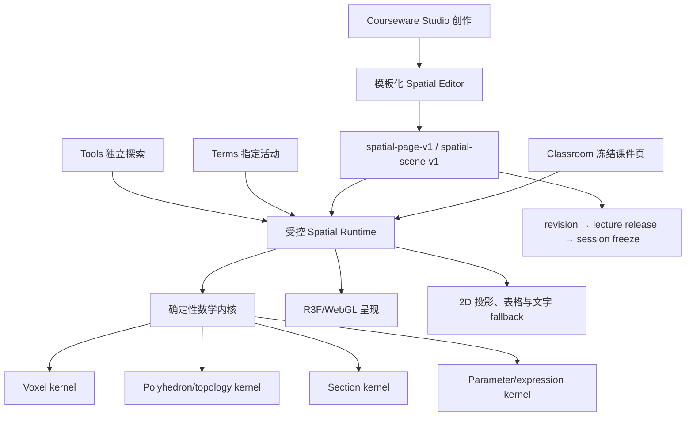

# Mathin 整体规划 · 28 空间数学实验室（立体几何教学系统）

> **规划状态**：`deferred`
>
> **用途**：冻结空间数学实验室的产品边界、课程能力、数学内核、场景协议、教研工作流、课堂合同、阶段顺序和量化验收门。
>
> **权威边界**：本文件不改变 R1-9、不增加 1.0 的 2 个 Tools、不重开已完成的 P4/P6；与 1.0 发布冲突时以 doc 00、04、25 为准。
>
> **最早施工入口**：R1-18 与 `v1.0.0` 完成后，由 doc 04 显式切换到后续 `SML-*` 阶段；在此之前只允许规划、题型金标和无生产依赖的算法 spike。
>
> **核对日期**：2026-08-11；依据现有 Three/R3F、Tools、Terms、Courseware Studio、Classroom、P6 release/freeze 代码与义务教育数学课程标准核对。

## 1. 执行结论

Mathin 建设一套“空间数学实验室”，服务从小学直观认识立体图形，到中学截面、参数、公式和函数变化的连续学习。系统首先解决课堂中的“看不见、转不动、数不清、无法验证”，再承担题目作答和结果记录。

产品采用“一套内核、四个使用表面”，不新增第七个公开板块：

| 表面 | 用户动作 | 系统结果 |
| --- | --- | --- |
| Tools | 学生或访客打开 `spatial-lab`，选择公开活动并自由探索 | 独立、可分享、可嵌入的空间数学实验 |
| Terms | 在观察物体、展开图、表面积等概念页进入指定活动 | 概念与可操作模型使用稳定关系连接 |
| Courseware Studio | 教研从模板建立模型、编排演示、添加检查点并插入讲次 | 严格校验的 `spatial-page-v1` 课件文档 revision |
| Classroom | 教师演示或开放学生探索/提交，叠加二维板书 | 读取冻结 release 的确定性场景；重连和回放结果一致 |

下列决定在 SML-0 复核后作为空间文档 v1 合同冻结：

| 编号 | 决定 | 原因与结果 |
| --- | --- | --- |
| D1 | 公开产品名暂定“空间数学实验室”，工具 ID 暂定 `spatial-lab` | 名称可覆盖小学立体几何和未来中学参数/函数，不把引擎绑定到单一题型 |
| D2 | 课程页继续使用 `CoursewarePage { type: "doc", docId }` | 复用现有页身份、评审、双轨发布、课次冻结、签名资产、预载和板书链 |
| D3 | 新增 `spatial-page-v1` 文档版本，内部承载 `spatial-scene-v1` | 保留冻结的 `page-doc-v1` 和爱学习文档合同；各版本独立严格校验和渲染 |
| D4 | 插入讲次时物化完整且有上限的 scene snapshot，并记录来源 release | 讲 release 和课次冻结自包含，避免课堂读取可变嵌套引用或依赖第二条发布链 |
| D5 | 数学内核使用纯 TypeScript、整数/有理数和确定性序列化；Three.js 只渲染 | 数量、投影、外露面、折叠与截面答案不由像素或浮点 mesh 反推 |
| D6 | 教研编辑器是“题型模板 + 有限参数 + 教学步骤”，不建设通用 CAD | 教师无需写 JSON、代码或三维坐标，核心任务能在五分钟内完成 |
| D7 | 课堂明确区分教师跟随、学生本地探索、学生提交三种 ownership | 学生探索不篡改教师权威场景，作答不向同班学生广播 |
| D8 | 持久化语义命令与检查点；相机拖动、hover 等瞬时状态走限频 realtime | 事件可审计、可回放，避免逐帧写数据库或离线 outbox |
| D9 | 第一期只支持程序化体素、规则实体和拓扑多面体，不上传任意 GLB/网格 | 减少内容消毒、体积、离线、版权和不可靠布尔运算风险 |
| D10 | 每个场景必须有正投影视图、分层/测量表和文字摘要 | WebGL 失败、低端设备、键盘和读屏用户仍能获得等价数学信息 |
| D11 | 空间页默认只创作 `standard-4x3` 原生布局；确有教学必要时才增加带双语理由的 `wide-16x9-exception` | 课堂、平板和板书区域统一按 4:3 设计；现有平台双 head 默认复用同一份 4:3 内容，宽屏例外也必须保留 4:3 主版本 |
| D12 | 系统按 `SML-0`～`SML-8` 分段交付 | 先证明数学正确和第一条课堂闭环，再扩展题型、公共内容与中学能力 |

## 2. 现有基础、缺口与施工约束

### 2.1 可复用基础

| 现有能力 | 证据范围 | 本系统的用法 |
| --- | --- | --- |
| Three.js、React Three Fiber、Drei 已为直接依赖 | Terms 星球场景已有 Canvas、OrbitControls、动态加载、响应式相机和 reduced-motion | 复用客户端叶子、资源释放和交互经验；不复用星球的领域模型 |
| Tools registry、独立页和 `/embed/[tool]` | 当前 2 个工具使用模块级动态加载，Terms 可引用工具 | `spatial-lab` 在 1.0 后成为第三个第一方工具 |
| 稳定 Terms ID 与关系 | 已有立体图形、观察物体、长方体和正方体、展开图、表面积、体积与容积、圆柱和圆锥 | 公开活动、模板和题型关联稳定概念，不以教材标题作主键 |
| CoursewareDoc 版本分发 | 已有 `page-doc-v1` 与 `aixuexi-page-doc-v1` | 新增独立 `spatial-page-v1` schema、编辑器和 renderer adapter |
| P6 发布链 | stable page → append-only revision → immutable lecture release → session freeze | 4:3 原生场景进入同一不可变课堂合同；平台双 head 默认物化相同 4:3 文档，宽屏例外才分布局 |
| 课堂事件、realtime `fx`、离线 outbox | `doc_step` 可确定性重放；持久事件与瞬时通道已分层 | 语义场景命令持久化，相机连续变化只瞬时同步 |
| 二维白板叠加 | pointer 模式可把事件交给底层，画笔模式捕获指针 | 同一课件页切换“操作模型 / 板书标注” |

### 2.2 当前缺口

1. 2026-08-11 已建立无生产依赖的体素、正方体展开图和多面体拓扑/几何 spike：体素覆盖整数坐标、分层、六向投影、隐藏块、连通分量、封闭空腔、内外表面和染色分类；展开图覆盖单位方格网规范化、自由多连方枚举和正方体 90° 精确折叠；通用多面体覆盖显式顶点/棱/有序面、闭合可定向球面壳、精确有理数顶点位置、面法向/共面性、相对面确认、铰链生成树、整数平面布局、自交/面重叠、目标二面角反解、层级三维刚体变换、最终闭合误差、确定性采样的非相邻面碰撞，以及自包含场景/4:3 页面/runtime 合同适配。连续时间碰撞无漏检证明、相邻面异常穿透、截面、完整单位检查和参数/函数求值内核仍未落地。
2. 已实现预生产 `spatial-scene-v1`、4:3 原生优先的 `spatial-page-v1`、`spatial-runtime-state-v1`、`spatial-command-v1`、学生私有 `spatial-attempt-v1`、`polyhedron-topology-v1`、`polyhedron-hinge-graph-v1`、`polyhedron-geometry-v1`、`polyhedron-net-layout-v1`、`polyhedron-fold-simulation-v1`、`polyhedron-fold-artifact-v1` 和 `polyhedron-scene-adapter-v1` 严格 schema，以及单写者 reducer、reset epoch、命令指纹、学生本地分支、确定性重放与 pinned-kernel 作答判定，并录入 20 道体素和 11 种正方体展开图工程金标候选；候选题尚未经教研签名与跨领域复核，新合同也尚未加入生产 `CoursewareDoc`、数据库/RPC/RLS、课堂 transport 或发布链冻结，教研编辑器和题型模板仍未落地。
3. 当前课堂 `tool_ctl` 只同步工具开关，各端工具内部状态独立，不能承载权威课程页。
4. Terms 的 `interactive` 目前只有一个工具字符串，无法区分同一工具的活动、preset 或 release。
5. 课件创建/保存 RPC 主要面向 `page-doc-v1`；新增版本必须严格分发，不能放宽成任意 JSON。
6. 外部资产 kind、上传校验、CAS manifest 和离线预载尚不支持三维模型；一期不扩任意模型上传。
7. 没有 WebGL context lost、禁用 WebGL、低端机、触控、键盘和三维视觉回归证据。
8. 中学内容 stage、导航、SEO 与消息合同尚未建立；renderer 不承担学段语义。

### 2.3 两个开工阻断项

`SML-0` 必须先关闭以下平台债务，任何第一条课堂纵向切片都不得绕开：

| 阻断项 | 当前风险 | 必须产物 |
| --- | --- | --- |
| release 与 legacy template 权威漂移 | Studio 新建/重排页面可能已进入 release，却未进入课次页面列表 | 课堂页面顺序和内容以所选 release snapshot 为唯一权威；legacy template 只作兼容投影，并在 publish 时原子重建 |
| lecture capability 校验不统一 | 部分 Studio/RPC 主要检查广义权限，未统一验证课程责任关系与状态 | 共享 capability resolver：身份 + permission + `course_staff_assignments` 责任关系 + lecture/release 状态；所有文档版本共用 |

必须增加一条纵向集成测试：Studio 创建/重排 4:3 空间页 → 平台双 head 发布（默认物化同一 4:3 文档）→ 课次备课 → freeze → live → 学生重连回放。该测试同时证明页面顺序、revision、scene hash、布局映射和权限没有漂移。

### 2.4 预施工合同与算法 spike 记录

2026-08-11 的首个施工增量只增加 `src/features/spatial-math/domain/` 纯 TypeScript 体素合同/内核与 `tests/spatial-math-voxel.test.ts`，未增加路由、数据库、课件版本、公开 Tool 或生产开关。它验证了 SML-1 的数学方向，但不关闭 SML-0 或 SML-1：20 道教研签名金标、scene/page/command 合同、目标设备性能、WebGL/fallback 和课堂纵向链仍是退出必需项。

同日第二个增量增加 `spatial-scene-v1` 的五类 entity、相机/分层、白名单步骤、checkpoint、公式 AST、三视图可达性、来源版本、512 KiB 门和跨端 canonical SHA-256。该 schema 仍是无数据库/无路由的预生产合同；只有与 20 道金标、`spatial-page-v1`、immutable release/session freeze 和历史回放共同通过后，才能在 SML-0 标记冻结。

同日第三个增量建立 20 道 `engineering-candidate` 体素题合同，覆盖 P1/P2/P3/P5 的观察、分层计数、隐藏块、染色、挖空、表面积与体积；每个期望值同时通过正式数学内核和独立测试 oracle 复核。该体素候选集只证明当前体素算法与人工期望一致，尚未经过教研签名，也不覆盖 P0 实体认识、P4 展开折叠和中学 M1/M2，因此不关闭 SML-0 或 SML-1。

同日第四个增量增加预生产 `spatial-page-v1`：物化 scene/hash、来源、课堂 ownership、学习检查和 fallback 与 presentation 分层；合同同时固定 640 KiB 门、语义事件持久化、教师 reset 权威、学生本地探索/提交边界、服务端 pinned-kernel 形成性检查与逐 checkpoint 二维降级。生产 `CoursewareDoc` 仍显式拒绝该版本，因此该增量不构成发布链接入，也不关闭 SML-0。

随后按用户拍板把页面合同收敛为 4:3 原生优先：普通场景只有 `standard-4x3`，不要求教研重复创作 16:9；确需横向并列等特殊教学布局时，额外 revision 使用 `wide-16x9-exception` 并填写双语理由。平台仍可维护既有两条 track head，但默认两条 head 物化相同 4:3 文档；宽屏例外的 native head 指向 16:9，adapted head 仍指向必需的 4:3 主版本。

同日第五个增量增加 `spatial-runtime-state-v1`、`spatial-command-v1` 与纯 reducer：教师权威和单个学生本地探索使用独立单写者 branch；命令按 scene hash、reset epoch、连续 sequence、actor 和 ownership 校验；精确重复通过 command ID + 确定性指纹幂等，复用 ID 改 payload、旧 epoch、序号缺口和跨 branch 写入均拒绝。snapshot 只保存可变覆盖与体素 delta，不复制完整 scene；状态/命令分别受 256 KiB/32 KiB 门约束。该增量未接 `session_events`、realtime、outbox、RPC 或 RLS，因此只证明领域状态机，不构成课堂纵向闭环。

同日第六个增量增加学生私有 `spatial-attempt-v1`、可信提交 binding、最小化 `spatial-attempt-evaluation-v1` 与 pinned-kernel 纯判定器。attempt 严格绑定 frozen scene hash、session/page/student、reset epoch、runtime state hash 和服务端已知的下一次提交序号；选择集合使用确定性顺序，正文受 256 KiB 门约束，幂等 key 只有在完整规范内容一致时才接受重试。判定器覆盖整数/有理数、单多选、实体/体素选择、自由解释证据、六类体素派生量和现有白名单公式子集；结果不回显原始作答、学生/课堂 ID 或标准答案。该增量未建立持久表、专用 RPC、RLS、授权教师查询、离线 outbox 或课堂 adapter，因此不构成可收集真实学生数据的生产能力。

同日第七个增量增加 `unit-square-net-v1` 与 `cube-net-kernel-v1`：输入使用有界整数方格、唯一且稳定顺序；规范化消除平移、四次旋转和镜像差异；有界枚举得到自由多连方序列 1/1/2/5/12/35；折叠沿方格邻接传播右手整数朝向，并以 `CELL_COUNT`、`DISCONNECTED`、`ORIENTATION_CONFLICT`、`FACE_OVERLAP` 显式拒绝非法网。35 种自由六连方中接受集合与 11 个独立固化的 `engineering-candidate` 金标规范键逐项一致，所有旋转、镜像和平移变体保持相同结论。该增量只覆盖正方体单位方格网的最终 90° 折叠，不含通用 polyhedron 面/棱拓扑、任意铰链、连续动画、自相交几何、scene/page 集成或触控 renderer，因此不关闭 SML-4。

同日第八个增量增加 `polyhedron-topology-v1`、`polyhedron-hinge-graph-v1` 与纯拓扑分析器。内容显式保存稳定 vertex/edge/face ID 和有序面边界；分析器检查未知/未使用顶点、重复端点、重复面、缺失边、每棱恰有两面、共享棱反向绕序、面图连通、顶点扇闭合和 Euler 示性数 2，并派生每面共享棱邻接和“不共享顶点”的相对面候选。铰链图绑定 topology/root face/edge/fold sense，必须以 `F-1` 条合法棱形成覆盖全部面的无环生成树，输出确定性父子折叠顺序。正方体与四面体正例、开壳/双壳/绕序/缺边/重复边负例和循环/断开/未知铰链均通过。该增量只证明属球闭壳与铰链树的组合拓扑；相对面仍须几何验证，二面角、平面面片坐标、自相交、连续折叠、scene adapter 和 renderer 尚未实现，因此不关闭 SML-4。

同日第九个增量增加 `polyhedron-geometry-v1`、`polyhedron-net-layout-v1` 与纯几何分析器。三维顶点使用规范有理数坐标，内核以 BigInt 分数精确检查重复位置、面退化、共面性、法向方向和平行且分离的相对面；二维展开布局使用有界整数坐标，逐面固定拓扑顶点周期，检查非零面积、面内自交、面间内部重叠、非铰链边界重叠、铰链端点对齐、根面和折角覆盖。合法布局沿铰链树输出稳定广度优先折叠程序，固定父面、子面、二维轴、山/谷折符号、微度目标角和线性角度进度；正方体十字展开正例及身份漂移、自交、重叠、错位和缺折角负例均通过。该增量尚未根据三维几何反解目标二面角，也未计算连续三维面变换、折叠过程碰撞或最终闭合误差，因此仍不关闭 SML-4。

同日第十个增量增加 `polyhedron-fold-simulation-v1` 与纯折叠模拟内核。请求固定从 0 到 1,000,000 的严格递增采样点、闭合微单位容差、101 帧/64 面/512 三角形预算；内核先用有理数精确比较每面全部点对距离，再把二维根面刚体对齐到目标三维面，按铰链树组合轴角变换。目标折角从父子面法向和稳定方向铰链轴反解为带符号微度，山/谷折或角度漂移单独报告；最终帧按全部语义顶点计算闭合误差。碰撞检测对每个指定进度三角化面片并诊断非相邻面内部穿透，输出明确的 `deterministic-samples-only` 证据等级，未采样时刻不得据此宣称无碰撞。正确正方体闭合、错误折向/角度、度量缩放、非法前置条件和 85% 进度可复现穿透均通过。该增量未接 renderer/scene/page，未证明连续时间无碰撞，也不关闭 SML-4。

同日第十一个增量增加 `polyhedron-fold-artifact-v1` 与 `polyhedron-scene-adapter-v1`。fold artifact 在单个 `polyhedron` entity 内物化 topology、geometry、hinge graph、二维 layout、采样请求、目标折角、闭合摘要及可直接绘制的二维展开图 fallback；`spatial-scene-v1` 解析时再次对账实体顶点/面与 artifact，拒绝双份几何漂移。adapter 只接受稳定有序的双语教学元数据和已通过模拟的折叠输入，生成 P4 场景、正交/立体相机、预测—观察—半折—验证步骤、相对面选择 checkpoint 和二维摘要，并提供 runtime 进度到折叠帧的纯解析器。正方体样例重复构建 hash 相同，且已物化为 1200×900 的 `standard-4x3` 预生产 page，初始 `net.foldTo=0` 可被既有 runtime 读取；生产 `CoursewareDoc` union 仍拒绝该页，因此本增量不构成发布链接入，也不关闭 SML-4。

同日第十二个增量增加首个 4:3 多面体呈现 spike。折叠内核在每个 face frame 中输出稳定的三角顶点索引，R3F 不再从浮点 mesh 反推或重新三角化数学面；纯 render model 负责把同一 frame 物化为面、边、标签、碰撞/选择状态、bounds 和已创作 camera bookmark。`renderer-r3f/` 提供模块级 `ssr:false` 懒加载的 `aspect-[4/3]` 舞台、`frameloop="demand"`、DPR 1～1.5、设计 token 调色、面命中、受控目标进度的本地折叠过渡和 reduced-motion 跳转；WebGL 不可用或 context lost 时切换到同一 artifact 生成的 SVG 展开图，保留全部面标签、铰链顺序和键盘面选择。专项合同增至 12 个文件/102 项并通过；该组件尚未挂到路由、Studio、课堂或生产 CoursewareDoc，也没有真实浏览器、目标设备、触控、context restored 和 bundle 证据，因此不关闭 SML-1 或 SML-4。

同日第十三个增量增加 `polyhedron-teaching-controller-v1` 和 4:3 教学交互舞台。纯 controller 从已校验的 `spatial-page-v1`、runtime state、actor 与 locale 派生当前步骤、相机、折叠进度、面选择 checkpoint 和权限，不复制权威状态；上一/下一步、指定步骤、相机、折叠终点和 reset 只输出严格 `SpatialCommandPayload` 意图，由未来宿主补 command ID、序号、branch、RPC/RLS 与持久化。面选择保持受控本地值，只有匹配 `student-submit` 私有分支时才能形成 choice attempt draft，仍不构造或发送正式 attempt。交互舞台在单个 `standard-4x3` 画布内提供步骤自动播放/暂停、相机书签、折叠滑杆、教师 reset、面选项与提交入口；滑杆拖动只做本地预览，`onValueCommit` 才产生一个语义终点，教师跟随学生保持只读，local explore/submit 只在匹配学生分支开放。专项合同增至 13 个文件/107 项并通过；本增量仍未接 classroom transport、attempt RPC、Studio、生产路由或浏览器 E2E，因此不构成 SML-2 课堂纵向切片。

## 3. 产品目标、用户与非目标

### 3.1 目标结果

| 用户 | 当前困难 | 目标结果 |
| --- | --- | --- |
| 教研老师 | PPT 动画难复用，模型参数和步骤难保持一致 | 从题型模板生成模型，编排预测—验证—解释流程，进入现有审核发布链 |
| 授课老师 | 临时工具不随课件冻结，课堂同步与板书割裂 | 正常翻到空间页，一键锁视角、切层、播放、重置、开放探索或收回答案 |
| 小学生 | 隐藏块、相邻面和空间旋转依赖想象，容易把透视图当作数量依据 | 用正投影、分层、透视/显隐、拼拆和精确计数建立空间表象 |
| 中学生 | 截面和参数变化停留在静态图，公式与几何量脱节 | 操作合法截平面或参数，看到几何量、表格、公式和函数图像一致变化 |
| 审核者 | 动画可播放不等于数学正确，发布后难追溯 | 查看 scene diff、派生答案、4:3 主预览、宽屏例外理由、可达性摘要和金标测试结果 |

### 3.2 非目标

首个正式版本不建设：

- 通用 CAD、自由曲面建模、任意网格/GLB/FBX/STL 导入；
- 任意实体布尔 CSG、物理仿真、AR/VR、WebGPU 专用路径；
- 通用 CAS、自动定理证明或面向高风险成绩的全自动判分；
- 多名教研同时编辑同一 scene、课堂内临时创建权威模型；
- 逐帧课堂录制、细粒度指针轨迹或未成年人非必要行为画像；
- 用 WebGL 截图、像素面积或浮点 mesh 作为数学答案权威。

## 4. 课程能力图谱与教学活动合同

### 4.1 能力分层

引擎按能力而非教材年级硬编码；教材版本、年级、讲次和教学目标作为内容元数据配置。

| 能力层 | 学习内容 | 核心模型/操作 | 依赖 |
| --- | --- | --- | --- |
| P0 认识 | 长方体、正方体、棱柱、棱锥、圆柱、圆锥、球；面、棱、顶点 | 旋转、分类、选择语义面/棱/点、实物与模型匹配 | 无 |
| P1 观察 | 正面、右面、上面正投影；视角匹配；体与面互推 | 正交相机、方向锁定、投影轮廓、遮挡显隐 | P0 |
| P2 构造与计数 | 单位正方体搭建、逐层计数、隐藏块、多视图约束与可能模型 | 整数格体素、增删块、层过滤、X-ray、约束求解 | P0～P1 |
| P3 染色与挖空 | 外露面、逐面/逐块染色、切割后分类、挖去/挖空、表面变化 | 面邻接、操作时序、连通与空腔、外露面精确计数 | P2 |
| P4 展开与折叠 | 展开图、相邻/相对面、方向保持、合法展开图 | 面拓扑、铰链图、折叠变换、自相交校验 | 平面图形、P0 |
| P5 测量 | 长度/面积/体积单位、容积、表面积、体积、分割拼合、复合体、圆柱圆锥 | 精确测量、单位、组合/差分、公式步骤 | P2～P4、面积 |
| M1 截面与重建 | 复杂三视图、坐标描述、棱柱/棱锥/旋转体的典型截面 | 平面与语义面求交、截面多边形、退化情况 | P1、拓扑、坐标 |
| M2 参数与函数 | 尺寸参数联动、公式推导、量随参数变化的表格与函数图像 | 白名单表达式 AST、单位检查、采样表、函数图 | P5、中学代数 |

现有课程数据中的“立体图形和展开图、立体图形计数、立体染色问题、染色与覆盖、立体图形与空间想象、染色与切片、体积综合、表面积综合”作为首批题型金标来源。题目文字和答案需由教研重新审核，seed 存在只证明课程锚点，不证明可直接发布。

### 4.2 每个活动的教学闭环

空间活动不能只提供自由旋转。每个可发布模板至少定义六步：

1. **预测**：模型先隐藏关键结果，教师提出观察或计数问题；
2. **定向**：锁定观察方向、层、尺寸、染色时机或截平面条件；
3. **操作**：旋转、搭建、拆除、染色、折叠或移动合法参数；
4. **验证**：切换正投影、逐层、X-ray、展开/折叠或截面视图；
5. **表达**：显示计数表、测量、算式或公式推导，而非只揭示数字；
6. **解释/提交**：要求选择、填数、标面、构造或用简短语言说明依据。

每个活动记录 `learningGoal`、`prerequisiteTermIds`、`misconceptions`、`teacherPrompts`、`revealPolicy` 和 `checkpointIds`。这些是内容合同，不进入数学 renderer 的分支判断。

### 4.3 首批模板族

| 模板族 | 教研可配置项 | 学生关键动作 | 权威派生量 |
| --- | --- | --- | --- |
| 三视图观察 | 实体、相机方向、可选视图、遮挡 | 旋转后回到正交方向、匹配视图 | 投影格集合、轮廓、可见面 |
| 分层计数 | 体素集合、层轴、隐藏策略 | 切层、X-ray、补/删单位块 | 每层数量、总数、隐藏数 |
| 多视图重建 | 前/右/上约束、允许解数量 | 搭建立体并提交 | 是否满足全部投影、等价解数量 |
| 染色分类 | 原始实体、染色面、切割/移除顺序 | 标面、分组、查看切后单元 | 0～n 面着色的单元数 |
| 挖去与挖空 | 移除集合或壳厚、是否保持连通 | 拆块、查看空腔和表面 | 剩余体积、外表面、内表面 |
| 展开与折叠 | 面图、铰链、面标签/图案 | 选择相邻面、拖动折叠 | 合法性、相对面、最终朝向 |
| 表面积与体积 | 尺寸、单位、拼拆步骤 | 选择分割法、展开、填算式 | 精确面积、体积、单位换算 |
| 截面 | 实体、允许平面族、参数范围 | 移动/旋转截平面、预测形状 | 精确交点与截面多边形 |
| 参数—函数 | 几何参数、约束、表达式和范围 | 拖动参数、观察联动 | 量值、单位、表格与函数数据 |

## 5. 总体架构

### 5.1 代码边界

| 层 | 建议目录 | 职责 | 禁止依赖 |
| --- | --- | --- | --- |
| Domain | `src/features/spatial-math/domain/` | zod schema、坐标、单位、ID、命令、序列化、hash 输入 | React、Three、Supabase |
| Voxel kernel | `.../kernels/voxel/` | 体素集合、投影、分层、隐藏块、染色、空腔、面积体积 | DOM、GPU |
| Topology kernel | `.../kernels/polyhedron/` | primitive 语义、面邻接、展开/折叠、精确测量 | R3F scene graph |
| Section kernel | `.../kernels/section/` | 平面与规则/凸多面体精确求交、退化判定 | visual clipping 结果 |
| Expression kernel | `.../kernels/expression/` | 白名单 AST、单位检查、求值和采样 | `eval`、任意 JS |
| Renderer | `.../renderer-r3f/` | InstancedMesh、Edges、选取、高亮、相机、视觉 clipping | 答案判定、数据库 |
| Runtime | `.../runtime/` | `scene/state/readOnly/onCommand`、模式和 surface adapter | 可变全局课程状态 |
| Editor | `.../editor/` | 模板、属性面板、步骤、检查点、4:3 主预览、宽屏例外与校验 | 通用 CAD 功能 |
| Presets | `.../presets/` | 内建活动与金标 scene；稳定 ID 和版本 | 教材标题硬编码 |

R3F Canvas 保持为 `next/dynamic`、`ssr:false` 的 client leaf。Server Component 负责鉴权、读取文档、静态壳和 fallback；非空间路由不得下载空间 renderer chunk。

## 6. 文档、数据与版本合同

### 6.1 五个版本化合同

| 合同 | 用途 | 生命周期 |
| --- | --- | --- |
| `spatial-scene-v1` | 数学模型、呈现、步骤、检查点和可达性摘要 | 被 activity/page revision 不可变保存 |
| `spatial-page-v1` | CoursewareDoc 分支，包含物化 scene、来源、4:3 原生 presentation 和可选宽屏例外 | 沿现有 page revision/release/freeze 发布 |
| `spatial-runtime-state-v1` | 当前步骤、显隐、层、教师镜头书签和 reset epoch | 课堂 snapshot + reducer |
| `spatial-command-v1` | 可审计语义命令 | 持久事件或教师/学生本地分支 |
| `spatial-attempt-v1` / `spatial-attempt-evaluation-v1` | 学生答案、构造结果，以及不回显答案正文的服务端判定结果 | 学生私有；生产接入后由学生本人和具备班级关系的授权教师读取 |

所有 schema 使用 `.strict()`、显式版本、大小/数量/深度上限和迁移适配器。旧版本永久可读；升级产生新 revision，不原地改写 release 或已冻结 session。

`spatial-page-v1` 本身使用内容布局 profile，不把平台 track 名写入文档：`standard-4x3` 是每页必需且默认唯一的原生布局；`wide-16x9-exception` 只在填写双语理由后作为可选第二 revision。layout-set validator 要求两种布局除 `layout` 与 `presentation` 外逐字节规范一致，阻止宽屏例外改变数学模型、答案策略或课堂权限。接入现有 `cw_page_revisions.track` 时，普通页的 native/adapted head 各自保存内容相同的 4:3 revision；有宽屏例外时仅 native head 使用宽屏 revision。

scene 同时声明 `kernelVersion` 与 `minRuntimeVersion`。部署新 runtime 前用全部历史金标和仍在保留期内的 release 做兼容回放；需要改变数学语义时发布新 scene/schema 或 kernel major，保留旧 evaluator，不能让同一 revision 因部署时间不同得到不同答案。客户端不下载或执行历史代码，所有兼容 evaluator 随受信任应用版本发布。

### 6.2 `spatial-scene-v1` 结构

| 区域 | 必需字段 | 规则 |
| --- | --- | --- |
| identity | `sceneId`、`schemaVersion`、`title`、`localePolicy` | ID 稳定；UI 双语，课程正文按现有回退合同 |
| space | 坐标系、单位、网格、精度 | 右手系、Y-up；数学坐标与渲染缩放分离 |
| model | `voxelSet / primitive / polyhedron / guide / label` entities | 每个 cell/face/edge/vertex 有稳定语义 ID |
| presentation | 背景、材质 token、正交/透视相机、视图书签、layers | 不允许任意 shader、外部 URL 或可执行代码 |
| sequence | 教学步骤、状态 patch、转场、教师提示 | patch 是白名单语义命令，不存 R3F 对象 |
| checkpoints | 问题类型、输入约束、答案策略、反馈与 reveal | 标准答案由内核重算；高风险评分另行授权 |
| formulas | 测量绑定、表达式 AST、单位、显示步骤 | M2 前可为空；禁止表达式字符串 `eval` |
| accessibility | 文字摘要、三视图、分层表、颜色标签、键盘顺序 | 发布必填；可由内核生成后由教研确认 |
| provenance | 模板/活动 release、创建者、内核版本；内容 hash 由外层 revision 保存 | 避免文档内自引用 hash；进入 revision 后不可变 |

确定性规则：对象按稳定 ID 排序，体素坐标用规范整数三元组，颜色使用语义 token，数值禁止 NaN/Infinity，数学量优先用整数或约分有理数。hash 输入采用仓库 `normalizeNewlines` / `textFileSha256` 相同的规范化纪律；JSON canonicalization 在 SML-0 固定并提供跨端测试向量。

### 6.3 v1 初始安全上限

SML-1 可依据目标设备测试向下收紧；放宽任何上限需要新性能证据，不能只改前端常量。

| 对象 | v1 上限 |
| --- | --- |
| 物化 scene JSON | 未压缩 512 KiB |
| occupied voxels | 8,192；编辑器超过 2,000 显示性能提示 |
| 非体素数学 entities | 256 |
| 教学步骤 / checkpoints | 200 / 100 |
| expression AST | 256 节点、深度 32 |
| 单条持久命令 | 32 KiB |
| runtime state snapshot | 256 KiB |
| 相机/hover `fx` | 每发送端最多 10 Hz、每条 8 KiB |

### 6.4 可复用活动与课件物化

可复用库采用稳定 identity + mutable draft + immutable revision/release：

| 概念对象 | 关键字段 | 权限/结果 |
| --- | --- | --- |
| `spatial_activities` | 稳定 ID、slug、学段、题型、owner、状态 | 用于发现、复制和关系，不被课堂直接消费 |
| `spatial_activity_drafts` | body、lock_version、updated_by | 教研自动保存和并发保护 |
| `spatial_activity_revisions` | revision_no、scene、hash、created_by | append-only 审阅依据 |
| `spatial_activity_releases` | release_no、revision_id、published_by/at | 公开/共享模板的不可变版本 |
| `spatial_activity_term_links` | term_id、relation_kind、sort_order | demonstrates / practices / requires |
| `spatial_page_revision_sources` | page_revision_id、activity_release_id、source_hash | 追溯来源；课件运行不依赖来源仍可读取 |

精确表名在 R1-9 公共内容发布合同关闭后由 SML-0 最终决定。关键不变量保持不变：把活动插入讲次时复制规范 scene 到 `spatial-page-v1` revision；之后活动发布新版本不会改变该讲次，教研通过“升级来源”显式生成新 page revision 并查看 diff。

一次性课堂模型允许直接在 Studio 的空间页中创建，不要求先发布到共享库。课次备课页只选择、编排、预览、批注和排练，不再放置第二套完整建模器。

### 6.5 Terms 关系

现有字符串 `interactive` 保持可读；新增结构化 binding：

| 字段 | 含义 |
| --- | --- |
| `kind` | `tool | spatial_activity` |
| `toolId` | 固定 `spatial-lab` |
| `activityId` / `releaseId` | 指向可公开读取的不可变活动 |
| `presetId` | 无数据库活动时指向内建版本化 preset |
| `mode` | `demo | explore | checkpoint` |

私有课程 scene 不通过公开 Terms 或 `/embed` 暴露；公开绑定只接受已发布、已审核、允许匿名读取的 activity release。

### 6.6 三维资产策略

一期 scene 只包含程序化参数、拓扑和体素 JSON，材质使用仓库 token，不依赖外部模型即可离线运行。以后确需真实物体或复杂教具时另开资产子阶段，至少同时完成：

- 仅允许经批准的 GLB/GLTF profile，新增明确 `model` asset kind、MIME、扩展名和内容嗅探；
- 冻结文件大小、三角面、材质、纹理分辨率、动画、骨骼和压缩扩展预算；
- 上传隔离、解析/消毒、许可证与来源、CAS hash、manifest、签名 URL、IndexedDB 预载和资源释放；
- 低多边形替代物、缩略图和 2D fallback；资产失败不影响 scene 的数学语义读取；
- 外部 mesh 只作视觉外壳，计数、测量、截面和答案仍引用经过审核的语义 primitive/polyhedron。

H5/iframe、任意网页模型和客户端临时 URL 不作为空间数学资产格式。

## 7. 数学内核

### 7.1 体素内核

体素以整数坐标占用集合为权威，渲染实例矩阵只是投影。v1 必须提供：

- X/Y/Z 轴分层、正投影占用集合、轮廓和每列高度；
- 总块数、可见/隐藏块、六向邻接、连通分量和封闭空腔；
- 每个 cell 的 0～6 个外露面、指定方向染色、操作前后染色语义；
- 明确移除集合或壳厚的挖去/挖空；不从中文题干猜测“空心”的含义；
- 单位块体积、外表面和需要时的内表面；组合体按集合运算精确复算；
- 多视图约束检查；枚举可能模型仅在明确维度和解数预算内运行，超预算返回可解释状态。

复杂枚举和大体素派生量移入 Web Worker；worker 与主线程共享纯 schema 和测试向量，不复制算法。

### 7.2 规则实体与多面体拓扑

`primitive` 保存长方体、棱柱、棱锥、圆柱、圆锥、球等数学参数；`polyhedron` 保存顶点、语义面、边和邻接关系。两者不被“任意三角网格”替代。

展开图使用“面 + 邻接边 + 铰链方向”图：

1. 验证面图与目标实体拓扑一致；
2. 沿生成树计算精确/容差受控的折叠变换；
3. 检查面重叠、自相交、方向和相对面；
4. 将连续动画视为确定性进度参数的呈现；最终合法性由拓扑内核判定。

正方体金标必须枚举 35 种自由六连方，接受且只接受 11 种展开图；旋转和镜像等价归一化。

当前预生产 spike 已完成上述 35/11 离散合同、通用闭壳面/棱邻接、铰链生成树、有理数三维面几何、整数平面展开布局、自交/重叠诊断、目标二面角反解、层级三维刚体变换、最终闭合误差、确定性采样的非相邻面碰撞，以及 `spatial-scene-v1`/4:3 page/runtime 的自包含适配，并保留 11 个教研待签名候选。拓扑层的“相对面候选”只表示两面无公共顶点；几何层再以位置、法向、平行性和面间分离确认相对面。首个 4:3 R3F/二维 fallback 组件只证明渲染合同可编译且纯物化测试通过；SML-4 后续仍需连续时间碰撞或保守 swept-volume 证明、相邻面异常穿透诊断、课堂交互，以及真实浏览器/触控/context recovery/bundle 证据；不得用离散采样未命中碰撞替代连续过程合法性。

### 7.3 截面

M1 先支持规则实体和凸多面体：以平面方程与语义边/面求交，去重并排序成截面多边形，显式报告过顶点、沿棱、共面和空交等退化情况。Three clipping plane 只显示截开效果，不作为截面答案。

圆柱、圆锥等曲面截面按单独题型和解析算法开放；任意曲面与任意布尔截割不进入 M1 首版。

### 7.4 参数、公式与函数

表达式使用白名单 AST：常量、参数、加减乘除、整数/有理数幂和经批准的函数节点。每个参数有单位、定义域、步长和几何约束；求值前做维度检查。显示层可用 KaTeX，表格/函数图使用同一求值器生成数据，禁止分别维护三套公式。

公式推导保存“等价变换步骤 + 教学说明”，不允许自由执行用户输入的代码。参数拖动只改变合法范围内的模型，退化点在图像和场景中同时标记。

## 8. Runtime、呈现与交互

### 8.1 受控运行时

统一运行时最小接口：`scene`、`state`、`mode`、`readOnly`、`onCommand`、`onAttempt`、`locale`、`layoutProfile`。独立工具、Terms、Studio 预览和课堂只实现 adapter，不复制数学状态机。

白名单语义命令包括：

- `view.set`、`camera.bookmark.apply`、`layer.set`、`visibility.set`；
- `voxel.add/remove/paint`、`entity.select`、`net.foldTo`、`section.plane.set`；
- `parameter.set`、`step.go`、`ownership.set`、`scene.reset`。

`checkpoint.submit` 不进入可广播 runtime command；它使用已建立的私有 `spatial-attempt-v1` 领域合同，生产接入仍须专用 RPC/RLS，避免把原始学生答案混入课堂状态。

每条命令包含 `commandId`、`sceneRevisionHash`、`resetEpoch`、branch、actor、连续序号和 payload schema。reducer 仅把 command ID、序号和确定性指纹都相同的请求视为幂等重试；旧 revision、旧 epoch、序号缺口、复用 ID 改 payload、非法 actor、跨 branch 或越界 payload 均以稳定错误码拒绝。snapshot 保存 scene 默认值之上的可变状态和体素 delta，不复制完整 scene。

当前多面体 scene adapter 已把 runtime 的 `net.foldTo` 浮点进度规范到百万分之一，并从 entity 内的 immutable fold artifact 重算对应面变换；adapter 结果可以进入预生产 4:3 page/runtime，但尚未进入生产课堂 transport、renderer 或发布链。

### 8.2 课堂 ownership

| 模式 | 权威写者 | 学生体验 | 持久结果 |
| --- | --- | --- | --- |
| 教师跟随 `teacher-follow` | controller | 接收步骤、显隐、层与可选相机书签；默认只读 | 教师语义命令、周期 snapshot |
| 本地探索 `student-local-explore` | 每名学生的本地分支 | 可旋转、切层和执行允许操作；一键回到教师态 | 默认不广播；需要续接时仅保存最小个人状态 |
| 学生提交 `student-submit` | 学生写 attempt，服务端验证 | 构造、选择、填数或标面后提交 | 私有 attempt；教师按班级关系读取聚合/明细 |

教师可在三个模式间切换，并决定是否“跟随镜头”。相机连续拖动不持久化；教师点击“锁定当前视角/加入步骤”才生成 durable bookmark 命令。

### 8.3 三维呈现

- 单位块使用 `InstancedMesh` 降低同几何体的 draw calls；选择和着色通过 instance 属性或分批实例实现；
- 观察物体、计数和展开图默认正交相机；仅在空间深度教学有意义时开放透视相机；
- 按需渲染，空闲暂停，DPR 设设备预算上限；页面不可见时停止动画；
- 一个空间页只创建一个 WebGL context；renderer 离开页面时释放 geometry/material/texture；
- 实现 `webglcontextlost/restored` 状态、重建策略和可见错误提示；失败时切到二维 fallback；
- 深色/浅色、颜色弱视、边线粗细、选中高亮和投影颜色使用设计 token，不把颜色作为唯一编码。

### 8.4 板书与指针仲裁

正式空间教学使用正常 doc page，位于 `MainBoard` 批注层下。工具 overlay 仅保留临时探索，不承担课程权威模型。

| 模式 | 3D 收到指针 | 白板收到指针 | 视觉提示 |
| --- | --- | --- | --- |
| 操作模型 | 是 | 否；透明穿透 | 轨道/手形光标、模型工具栏 |
| 板书笔/荧光笔/橡皮 | 否 | 是 | 画笔光标、当前笔型 |
| 选择批注 | 按命中优先级 | 是 | 明确图层和 Esc 退出 |

二维批注继续按 `docId` 绑定；scene reset 不删除批注。若页面 revision 改变，Studio/备课预览必须提示批注坐标是否仍可复用。

## 9. 教研创作、审核与发布

### 9.1 创作流程

1. 在讲次工作区选择“添加页面 → 空间数学实验室”；
2. 选择题型模板或已发布活动，可搜索 Term、能力层、年级和教材元数据；
3. 通过尺寸、体素画笔、颜色、面、层、相机和合法参数建立模型；
4. 用时间线添加预测、操作、验证、揭示和 checkpoint；
5. 预览教师/学生模式下的 4:3 主布局；只有选择“宽屏例外”时才增加 16:9 对照预览并填写理由；
6. 运行 schema、数学、可达性、大小和性能预算校验；
7. 保存 draft，提交 reviewer，按现有权限发布 lecture release；
8. 课次备课只选择 release、编排 overlay、批注和排练；完成备课后冻结 exact release、scene hash 与资产。

### 9.2 编辑器布局

空间编辑器是 Studio 内的重型 client 交互叶子：

- 左侧：模板、模型树、体素/实体和属性；
- 中央：4:3 主舞台、相机书签、操作/板书预览；宽屏例外开启后显示 16:9 对照；
- 右侧：教学目标、步骤、问题、答案、提示与 accessibility summary；
- 底部：步骤时间线、错误/警告、派生量和版本 diff。

基础路径只显示题型所需控件；“高级”仍只允许 schema 中的合法字段。教研不接触原始 JSON、Three scene graph 或表达式代码。

### 9.3 4:3 原生布局与平台 track 映射

新建空间页先创建 stable page identity 和唯一 `standard-4x3` 内容 revision，viewport、相机、标签布局和教师工具位置全部以 4:3 为原生坐标。为兼容现有发布链，同一事务仍建立两条平台 track head，并分别物化内容相同、hash 相同的 4:3 revision；教研不需要维护两份布局。

只有教研明确选择“宽屏例外”并填写双语理由时，才额外生成 `wide-16x9-exception` revision：native head 指向宽屏 revision，adapted head 继续指向 4:3 主 revision。两种 layout 的 scene/hash、来源、ownership、学习检查和 fallback 必须一致。缺 4:3 主版、fallback 缺失、hash 漂移或宽屏理由缺失时禁止 publish。

为 `spatial-page-v1` 建专用或严格 version-aware 的 create/save RPC 和 Server Action。入参先过 zod；数据库再次检查 docVersion、大小、权限、责任关系、状态和 optimistic `lock_version`。禁止让旧 `pageDocSchema` 接受任意新字段。

### 9.4 审核界面

审核者查看：

- scene revision 的语义 diff，而非难读的原始 JSON；
- 新增/删除体素、尺寸、面邻接、步骤、checkpoint 和答案策略变化；
- 内核重算的派生量与金标期望；
- 两轨、教师/学生、WebGL/fallback、zh/en UI 预览；
- schema/性能/可达性/安全校验结果和来源 release。

发布后修订生成新 activity/page/lecture release；历史课次与已开始课堂保持冻结。

## 10. 课堂同步、离线与学习检查

### 10.1 状态分层

| 状态 | 示例 | 通道 | 恢复方式 |
| --- | --- | --- | --- |
| 内容状态 | 模型、步骤、答案规则 | lecture release / session freeze | 预载不可变 page doc |
| 权威演示状态 | 当前步骤、层、显隐、reset epoch | durable semantic event + snapshot | 最近 snapshot + 后续事件 |
| 瞬时呈现状态 | 相机拖动、hover、指针光标 | 限频 realtime `fx` | 可丢；回到最近书签 |
| 学生本地探索 | 本地相机、未提交搭建 | client/可选个人缓存 | 一键回教师态；不影响他人 |
| 学生 attempt | 答案、构造差异、服务端结果 | 专用 RPC/RLS | 学生本人和授权教师读取 |

晚加入者先校验 frozen scene hash，装载最近 runtime snapshot，再按序重放语义命令。snapshot 与命令都带 epoch；reset 创建新 epoch，旧 outbox 命令不能污染新状态。

### 10.2 持久事件原则

持久化“切到第 3 层、隐藏辅助线、执行步骤 4、锁定视角 B、提交检查点”等可解释动作。拖拽相机、每一帧折叠动画和 hover 不进入 `session_events`。折叠只持久化目标进度或步骤 ID，各端用同一 easing 和 reduced-motion 策略呈现。

学生事件需要新增严格白名单、payload schema、RPC 和 RLS；不能把现有仅允许 `hand|answer` 的合同放宽为任意空间命令。教师控制事件只能由 controller 写入，学生 attempt 不通过班级广播通道返回原始内容。

### 10.3 离线

- session 预载包含 frozen `spatial-page-v1`、fallback、必要字体/纹理和内核版本；一期没有外部模型资产；
- CAS/object hash 校验失败时拒绝进入权威互动，显示二维 fallback 和可恢复错误；
- 教师 durable 命令与学生 attempt 进入现有 outbox，使用 idempotency key；瞬时 `fx` 不入 outbox；
- 网络恢复后先对 scene hash/epoch，再幂等补发；冲突的旧学生本地分支要求用户选择回到教师态或重新提交。

### 10.4 学习检查

首版支持：单选/多选、整数/有理数填空、选择语义面/棱/点、提交体素集合差异、给定选项中的展开图/截面。已建立的预生产 attempt 判定器由冻结 page 的 scene hash 与 `kernelVersion` 决定答案语义，并复核可信 session/page/student、reset epoch、runtime state hash、提交序号、checkpoint 开启状态和响应类型；客户端不得上传分数或标准答案。生产 RPC 必须在事务内生成可信 binding、执行同版本纯内核、按 idempotency key 写入私有 attempt，再返回不含原始作答和标准答案的最小结果；客户端即时反馈仅作体验，不作成绩权威。

自由文本解释保存为课程学习证据，不自动判定数学正确。若未来进入正式成绩，必须另建评分量规、人工复核、申诉和版本追溯门。

## 11. 路由、权限与数据访问

### 11.1 路由

| 路由 | 角色 | 内容合同 |
| --- | --- | --- |
| `/[locale]/tools/spatial-lab` | 公开 | 内建 preset 与公开 activity release；动态加载 runtime |
| `/embed/spatial-lab` | 公开嵌入 | 仅公开 release/preset；locale 和 mode 为受限参数 |
| `/[locale]/terms/concepts/[slug]` | 公开 | 通过结构化 relation 加载指定活动 |
| `/[locale]/dashboard/courseware/lectures/[lectureId]` | 授权 staff | 讲次工作区、空间页入口、状态和发布 |
| `/[locale]/studio/courseware/[lectureId]` | 授权 staff | 现有 Studio 内分发空间编辑器，不建立平行课件系统 |
| `/[locale]/dashboard/courseware/spatial` | 授权 staff，后续 | 可复用活动库、审核、复制和发布；无需求时可延后 |
| `/[locale]/dashboard/sessions/[sessionId]` | 授权 staff | 选择 release、预览、批注、排练和 freeze；不做完整建模 |
| `/[locale]/classroom/[classId]/session/[sessionId]/live` | session member | 消费 frozen native doc、课堂状态和 attempt |

所有 locale 路由使用项目 navigation 封装；受保护页面调用 `requireUser(locale)`，动态数据放在 Suspense/loading 边界内。`/embed` 不成为私有课件绕过鉴权的通道。

### 11.2 权限矩阵

| 动作 | permission | 额外关系/状态 |
| --- | --- | --- |
| 创建/编辑空间页或活动 | `courseware.page.edit` | 课程责任关系；draft/revision 可编辑状态 |
| 提交/审核活动 | `courseware.review` | reviewer 责任或显式分配；不能审核自己时由组织策略决定 |
| 发布 lecture/activity | `courseware.release.publish` | 责任关系、4:3 主版、平台 head 映射和所有门通过 |
| 紧急发布 | `courseware.emergency_publish` | 原因、审计、到期复核；不能跳过 schema/RLS/数学安全门 |
| 启动/控制课堂 | 现有 session controller 合同 | session membership、课次状态、frozen release |
| 学生提交 | session student membership | 只写本人 attempt；不能写教师 runtime state |
| 读取学生明细 | 现有教师/教务授权 | 同班/同课程关系；跨组织拒绝 |

所有能力通过共享 lecture/session capability RPC 判定；前端隐藏按钮只优化体验。学生、家长和匿名用户不直接读取 `cw_*` 或私有 activity 表，继续走 release/session membership RPC 与签名对象。

## 12. 视觉、响应式、双语与可达性

### 12.1 视觉

- 公开 Tools 外壳沿用商人星，空间画布只保留纸色、墨线和一个低饱和语义强调色；
- Studio/Classroom 使用工作区级小王子语言，画布、工具栏和实时控件不放叙事装饰；
- 面、棱、点、层、切面和隐藏对象使用固定语义 token；颜色之外同时提供纹理、线型、编号或标签；
- 正交三视图保持比例与方向标记，透视效果不能遮蔽数学边界；
- 相机转场克制，遵守 reduced-motion；教学步骤可直接跳到最终状态。

### 12.2 响应式与触控

沿用 doc 27 的 1024～1280 工作区收敛：

- 4:3 主舞台必须在 1024px 横屏完成旋转、切层、重置和提交；宽屏例外另做同等验收；
- 触控旋转、缩放与体素编辑使用互斥工具，避免双指页面滚动和模型缩放冲突；
- 小屏属性面板折叠为 drawer，关键课堂控制不隐藏在二级菜单；
- fullscreen 不依赖浏览器地址栏高度，安全区和软键盘不遮挡提交按钮。

### 12.3 等价 fallback

每个发布场景必须生成并校验：

1. 前/右/上正投影的 SVG 或 2D canvas 数据；
2. 按轴的分层表、数量和可见性摘要；
3. 面/棱/顶点或测量的结构化表；
4. 描述当前步骤、选择和结论的可读文本；
5. 键盘可达的对象树和操作列表。

WebGL 不可用时仍允许观察、切层、查看表格和完成适合二维表达的 checkpoint；需要三维构造的活动明确说明限制并提供替代题。

### 12.4 双语

工具栏、错误、空状态、模板分类、互动提示、可达性标签和 SEO 同时维护 zh/en，messages key 100% 对齐。课程题干允许按现有规则只发布中文，但 `/en` 必须显示明确回退标签；稳定 scene/entity/command ID 不含语言。

## 13. 性能、安全、遥测与运维

### 13.1 性能预算

| 指标 | 退出门 |
| --- | --- |
| 代表小学场景交互帧时间 | 目标 iPad Safari 与学校 Chrome 的 p95 ≤33ms |
| 预载后首个可操作画面 | p95 ≤1s |
| 体素代表规模 | 1,000 个单位块持续满足帧预算；8,192 为 schema hard cap，不代表默认内容目标 |
| 非空间路由 bundle | 不含 R3F/空间 renderer chunk；共享 gzip 回归 ≤5 KiB 且逐项解释 |
| durable 命令 | 教师语义操作无丢失；相机等 `fx` 丢失不影响最终数学状态 |
| context | 每页 1 个；切页和恢复后无持续增长的 geometry/material/context |

边界变更前后运行 `pnpm bundle:report`。性能报告记录设备、浏览器、scene hash、体素/面数量、DPR、热/冷启动和采样方法，不能用桌面开发机均值替代目标设备 p95。

### 13.2 安全

- scene/page/command/attempt 全部经过客户端与服务端 zod、数据库范围检查和 RLS；
- 禁止 script、HTML、shader、任意 URL、data URI、任意表达式执行和超预算递归；
- 服务端按 pinned kernel/version 重算 attempt，客户端答案不可信；
- 公开 activity 与私有课程对象分表/状态或严格策略隔离，签名 URL 不能长期写入 scene；
- 对其他组织、课程、班级、学生和未发布 revision 建立负向 RLS/RPC 测试；
- 紧急发布不能绕过文档解析、大小、数学退化和资源 hash 门。

### 13.3 最小遥测

允许事件：`spatial_activity_open`、mode/view/layer 切换、reset、step、checkpoint 结果类别、context lost/recovery、fallback、性能桶。记录 activity/page release ID、schema/runtime 版本、设备能力桶和匿名 session 关联。

不采集原始连续指针轨迹、相机逐帧数据、自由文本答案内容或可识别学生的公开分析事件。学生答案保留和删除沿学校学习证据/用户权利合同执行。

### 13.4 运维

监控 WebGL 初始化失败率、context lost、scene schema 拒绝、command 拒绝、重连收敛、attempt 失败、fallback 使用和性能超预算。运行时出现未知 docVersion 时显示可恢复错误和静态摘要，不能白屏或静默跳过页面。

## 14. 实施阶段

下列编号是本专题的依赖顺序；只有 doc 04 将其中一项写为唯一当前施工阶段后才能施工。每阶段完成时同步本文件状态、doc 00/04/25、证据索引和 `pnpm plan:audit`。

| 阶段 | 依赖 | 动作与产物 | 退出证据 |
| --- | --- | --- | --- |
| **SML-0 合同与金标冻结** | v1.0.0；R1-9 公共内容合同 | 解决 release/template 和 capability 两个阻断项；冻结能力图谱、20 道代表题、五个 schema、canonical hash、ownership、上限、路由和非目标 | 20 道题由教研签名；跨端 hash 向量 100%；create→publish→prep→freeze→live 空壳纵向测试通过 |
| **SML-1 精确内核与技术 spike** | SML-0 | voxel kernel、正投影、分层、外露面；R3F instancing、picking、worker、context recovery、2D fallback、低端设备基准 | 生成式测试 100% 对 oracle；1,000 体素达到性能门；WebGL 禁用/丢失可恢复；非空间 bundle 无重型 chunk |
| **SML-2 首条课堂纵向切片** | SML-1 | “多角度观察 + 分层计数”；Studio 4:3 模板编辑、`spatial-page-v1`、平台 head 映射、评审发布、freeze、教师跟随、板书和重连 | 教研 P90 ≤5 分钟；一份 4:3 创作完成平台发布；1 教师+30 学生重连 3 秒内一致；离线预载/回放 E2E 通过 |
| **SML-3 小学体素题型扩展** | SML-2 | 染色、隐藏块、挖去/挖空、外/内表面、体积、表面积和组合体；学生构造/提交 | 所有派生量金标与生成式测试 100%；attempt RLS 负向测试通过；至少 6 个生产模板 |
| **SML-4 展开图与折叠** | SML-1、SML-3 的面语义 | polyhedron/topology kernel、面邻接、连续折叠、碰撞诊断、相邻/相对面和方向题 | 35 种自由六连方/11 种正方体展开图合同通过；重叠/非法网显式拒绝；连续碰撞证据等级明确；两轨/触控可用 |
| **SML-5 教研库与课堂硬化** | SML-2～4 | activity draft/revision/release、Terms 关系、语义 diff、复制升级、offline/outbox、容量和运营指标 | 至少 12 个小学金标模板；发布/升级不改变历史课次；连续 3 次 30 人 E2E 无 flaky；安全/性能/a11y 门通过 |
| **SML-6 公共 Tools 与内容发布** | SML-5；1.0 后 Tools 立项 | `spatial-lab` 独立页/embed、7 个相关 Terms 活动、公开 SEO/分享、匿名访问隔离 | public/private 负向测试；zh/en UI；公开活动无私有 URL；Terms 坏链=0；普通路由 bundle 门通过 |
| **SML-7 中学实体、重建与截面** | SML-4～6；中学 stage/导航合同 | 复杂三视图、坐标、规则实体/凸多面体截面、典型曲面截面和退化解释 | 截面 oracle/金标 100%；中学 stage、SEO、关系和教材元数据不由 renderer 硬编码；试讲通过 |
| **SML-8 参数、公式与函数联动** | SML-7；单位系统 | expression AST、单位、公式步骤、参数约束、表格和函数图联动 | 同一求值器驱动模型/公式/表/图；单位和定义域负向测试；无 `eval`；教学试点达到签收门 |

SML-2 是最小可上线纵向切片；SML-3/4 才覆盖完整小学核心范围；SML-7/8 属中学扩展，不能拖延 SML-2～6 的小学课堂价值验证。

## 15. 量化验收门

### 15.1 数学正确性

- 投影、分层、隐藏块、外露面、染色类别、空腔、表面积和体积的生成式测试与独立 oracle 一致率 100%；
- 35 种自由六连方中仅 11 种正方体展开图被接受，旋转/镜像归一化正确；
- 同一 scene revision + runtime snapshot + event log 在教师/学生/重连端的最终 canonical state hash 100% 一致；
- 非法尺寸、重复/重叠、NaN/Infinity、越界、超预算和退化截面均返回稳定错误码，不静默修正；
- renderer、fallback 与服务器 attempt evaluator 使用相同领域测试向量。

### 15.2 教研效率与内容

- 从模板创建模型、添加一个演示步骤和一个 checkpoint、插入讲次的 P90 ≤5 分钟；
- 核心路径不要求 JSON、代码、三维坐标或外部模型上传；
- SML-0 有 20 道代表题；小学发布时至少 12 个金标模板，覆盖 P0～P5，每个含 demo/explore/checkpoint；
- 每个模板关联稳定 Term、目标、前置、误解、答案策略、审核人和 4:3 主预览；宽屏例外另含理由与对照；
- 草稿、审核、发布、升级、回滚和课次冻结全部可追溯；新 release 不改变已开始或历史课次。

### 15.3 课堂

- 1 教师 + 30 学生：串班、串户、教师权威状态丢失均为 0；重连 p95 ≤3s 收敛；
- 教师可一键 reset、锁视角、切层、显隐、播放/暂停、开放/收回探索；
- 学生本地探索不能写教师状态；原始学生答案不向同班广播；
- 预载后核心活动断网可用，恢复后 durable event/attempt 幂等补发；
- 3 次试讲与至少 5 节真实课堂覆盖“预测—验证—解释”，记录常见误解和教师操作负担。

### 15.4 性能与稳定性

- 目标 iPad Safari 与学校 Chrome：代表场景 frame time p95 ≤33ms，预载后首个可操作画面 p95 ≤1s；
- WebGL 可用、禁用、context lost/recovery、reduced-motion、触控、键盘、1024 横屏、light/dark、zh/en 全部有自动或人工证据；
- 空间代码按需加载；非空间路由不包含 renderer chunk，共享 gzip 回归 ≤5 KiB；
- 连续切换 50 个空间/普通课件页后 context、geometry、material 和 listener 无单调增长；
- scene、command、snapshot 和 `fx` 均满足 §6.3 上限。

### 15.5 可达性与安全

- 键盘完成旋转书签、视图、切层、对象选择、步骤和提交；焦点顺序稳定；
- 颜色均有标签/纹理/线型；reduced-motion 可关闭连续折叠和相机飞行；
- 每个 scene 有三视图、分层/测量表、文字摘要和 WebGL fallback；
- zh/en messages key 100% 对齐，无业务 UI 硬编码单语；
- 跨组织/课程/班级/学生、未发布 revision、伪造 scene hash、越界 command、重复 attempt 的负向测试全部拒绝；
- scene 中可执行代码、任意外链和长期签名 URL 数量为 0。

### 15.6 研究与发布证据

正式扩大使用前至少完成 5 位教研/教师任务测试、3 次排练、5 节真实课堂。证据记录任务完成时间、需要帮助次数、误操作、学生预测/验证/解释完成情况和改进决定；“页面能打开”不能替代教学有效性证据。

仓库只登记无 PII 的摘要、scene/template ID、commit、schema/kernel 版本、hash 和受控 artifact 索引；课堂录像与学生材料遵守现有同意、访问角色和保留期。

## 16. 风险、降级与开放决策

| 风险 | 早期信号 | 降级/关闭条件 |
| --- | --- | --- |
| 视觉正确但数学错误 | renderer 结果与纯内核/金标不一致 | 阻止发布；以内核和独立 oracle 为准，renderer 只修呈现 |
| 教研编辑器过于复杂 | P90 超过 5 分钟、频繁进入高级面板 | 缩减自由度、增加题型模板；不以增加 CAD 控件解决 |
| 低端设备卡顿或 context 丢失 | p95 超预算、fallback 率上升 | 降低内容 hard cap、自动简化边线/阴影、切 2D；不降低数学精度 |
| 课堂事件风暴 | durable events 随帧率增长、outbox 膨胀 | 只允许语义命令；相机关闭跟随或限频 `fx` |
| 嵌套版本漂移 | activity、page、lecture、session hash 不可解释 | 课件物化 snapshot；来源只追溯，不在课堂运行时解引用 |
| 白板与模型抢指针 | 旋转时落笔或画笔时相机移动 | 强互斥模式、明显状态、快捷键和 Esc 退出 |
| 颜色/三维成为唯一信息 | WebGL 失败即无法答题、读屏无内容 | 发布门强制 fallback、结构化表和文字摘要 |
| 中学扩展拖大首版 | 任意 CSG/CAS/曲面需求进入 SML-2 | 按非目标拒绝；仅在 SML-7/8 立项并新版本化 |

SML-1 后需定案的开放项只有：目标设备最低 GPU/浏览器清单、8,192 体素上限是否下调、公开活动是否允许匿名保存本地进度、圆柱/圆锥截面的首批解析范围。任意模型上传、通用 CSG、WebGPU 和正式自动评分维持延期，除非另建专题规划和发布门。

## 17. 参考资料

### 17.1 仓库内权威

- doc 00：1.0 产品、视觉、语言与规划读取合同；
- doc 01、05、27：设计 token、工作区视觉和 1024～1280 响应式合同；
- doc 03：鉴权、RLS、registry 与技术基线；
- doc 08：Classroom/Whiteboard 历史实现；
- doc 16：Courseware revision、双轨 release、session freeze、资产与预载；
- doc 25：1.0 发布范围、量化门、证据与生产边界；
- doc 26：讲次工作区、备课预览、批注与结构化教案边界。

### 17.2 外部一手资料

- [教育部：义务教育课程方案和课程标准（2022年版）通知](https://www.moe.gov.cn/srcsite/A26/s8001/202204/t20220420_619921.html?fromColId=194)
- [义务教育数学课程标准（2022年版）PDF](https://www.moe.gov.cn/srcsite/A26/s8001/202204/W020220420582346895190.pdf)
- [Three.js WebGLRenderer](https://threejs.org/docs/pages/WebGLRenderer.html)
- [Three.js InstancedMesh](https://threejs.org/docs/pages/InstancedMesh.html)
- [three-bvh-csg 项目状态与限制](https://github.com/gkjohnson/three-bvh-csg)
- [Manifold 几何内核](https://github.com/elalish/manifold)

外部库资料只支持技术选型判断，不证明本系统在目标设备、题型和课堂容量下达标；SML-1 仍需仓库内基准、数学 oracle 和浏览器证据。
