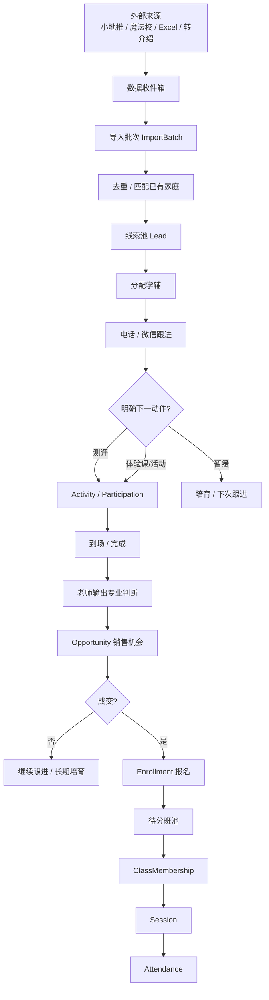

# Mathin 学辅运营与教学履约一体化规划

> **规划状态**：`active`
>
> **当前用途**：指导 `DEV-SCHOOL-OPS-1` 按 Phase 0～6 建设学辅运营与教学履约主干。
>
> **当前里程碑**：`Phase 1 · 数据收件箱 + 线索工作台`；首个产品验收面必须是可真实导入、填写、分配和跟进的业务工作台。
>
> **权威边界**：当前唯一施工阶段仍由 `04-roadmap.md` 决定；本计划作为 R1-Live 双轨中的隔离开发预演，不自行授权生产迁移、写入或发布。
>
> **最后核对**：2026-09-01。

> 文档定位：用于指导 Mathin 后续学辅运营、销售转化、报名入班与教学履约链路的整体建设。
> 当前阶段重点：先建立可真实运行的业务主干，再逐步补齐页面、统计与自动化。
> 适用对象：产品规划、Agent 开发、运营负责人、学辅团队、教务/教学团队。

---

## 0. 结论先行

Mathin 当前最需要建设的并不是一个更完整的“学生 360”，而是一套真正成为日常工作入口的 **运营工作流中枢**。

现有业务已经具备多个成熟功能来源：小地推小程序负责线索采集，魔法校承担部分活动报名、订单、学生档案与营销功能，Excel / 石墨 / 飞书表格承担大量实际流程协同，校宝小程序承担教师考勤。问题集中在这些环节之间仍依靠人工导出、整理、复制、建表、分班和二次录入完成衔接。

Mathin 的第一阶段使命应明确为：

> **从外部名单进入开始，贯通“线索 → 邀约 → 测评/体验 → 销售机会 → 成交 → 报名 → 待分班 → 班级 → 课次 → 考勤”，把目前由人工和表格承担的胶水层收回系统。**

核心设计应围绕以下五个关键词展开：

**身份统一、批次驱动、对象分层、下一动作、自动流转。**

---

# 1. 当前业务现状与问题定性

## 1.1 现有系统并不缺“功能”

魔法校已经具备较成熟的学生管理体系，包括潜在学生、历史学生、在读学生、跟进、活动、报名、订单、测评、课表、班级和学生详情等能力。

从截图来看，其学生详情已经接近典型 Student 360：基本信息、跟进信息、活动、课表、测评记录、账户等都可统一查看。

因此，Mathin 的问题不应被定义为“缺少学生管理系统”，而应定义为：

> **现有系统没有成为业务流转的必经路径。**

---

## 1.2 表格实际上承担了三类系统职责

团队长期使用 Excel、石墨、飞书云表格、飞书多维表格，说明表格并非单纯的数据存储工具，而是在实际业务中承担了：

| 表格实际承担的职责 | 典型场景 |
|---|---|
| 人工 ETL | 小地推导出 Excel，再整理、去重、补信息 |
| 日常工作台 | 今天打谁的电话、谁已报名、谁待跟进 |
| 系统间接口 | 测评名单 → 报名名单 → 正式课名单 → 建班名单 |

这也是为什么即使已经存在较成熟的后台，团队仍然会持续建立新表。

---

## 1.3 根本矛盾：对象管理与工作流管理错位

传统后台的入口通常是：

- 学生管理
- 活动管理
- 测评管理
- 订单管理
- 班级管理

但学辅每天真正面对的是：

- 今天新来的这批名单谁还没联系？
- 已联系的人里谁答应来测评？
- 周六测评报名了多少？实际来了多少？
- 测评完成后哪些家庭需要继续转化？
- 已经成交的学生有没有进入正式课名单？
- 正式课名单是否已经完成分班？

因此，Mathin 必须从“功能菜单型后台”转向：

> **围绕一批人、一件事和下一动作组织工作的运营系统。**

---

# 2. Mathin 的系统边界

## 2.1 第一阶段接受外部系统继续存在

短期内以下工具无需替代：

- 小地推小程序：继续扫码采集家长联系方式、扫码位置等信息；
- 魔法校：继续承担部分活动二维码、公开课报名、订单等已有能力；
- 其他支付场景：继续允许线下或外部支付；
- Excel：继续作为外部系统与 Mathin 之间的重要输入/输出格式。

Mathin 第一阶段的定位不是“一次性替代所有系统”，而是：

> **成为跨系统业务数据进入后的运营主系统和事实中心。**

---

## 2.2 学辅与教学职责明确分离

在公司当前语境下，学辅更接近：

- 招生运营
- 私域维护
- 电话邀约
- 测评/体验活动承接
- 产品推荐
- 销售转化
- 续报
- 唤醒
- 转介绍

正式课后的日常教学沟通并不是学辅主职责。

因此系统应形成两条相互关联但独立工作的业务线：

```text
                    Student / Family
                           │
             ┌─────────────┴─────────────┐
             │                           │
          商业运营域                    教学履约域
             │                           │
       获客 / 邀约 / 活动             班级 / 课次 / 考勤
       测评承接 / 销售机会             作业 / 测评 / 教学记录
       报名 / 续报 / 唤醒              教学反馈 / 学习表现
```

两侧共享 Student / Family 身份，但不共享同一个工作流。

---

# 3. 核心设计原则

## 3.1 业务流优先于页面完整度

先验证真实业务链能否完整运行，再逐步补齐统计、360 详情、复杂权限和高级自动化。

## 3.2 外部数据进入后，Mathin 成为事实中心

Excel 可以继续导入、导出，但长期业务状态、负责人、参与结果、成交结果和班级归属应回写 Mathin。

## 3.3 每增加一个必填动作，都应减少至少一个后续人工动作

例如“确认已成交”之后，应自动进入待分班，而不是再让运营人员发送一份名单给教务。

## 3.4 先允许信息不完整，再逐步补全身份

一条地推线索可能只有家长电话和扫码位置。系统应允许先创建 Lead / Contact，后续联系成功后再补 Student。

## 3.5 重复发生的业务行为必须独立成记录

测评、活动参与、沟通、报名、续报、考勤等都属于可重复事件，不能无限扩展为 Student 表上的字段。

## 3.6 前台保持表格型工作体验，后台保持结构化数据

学辅习惯批量筛选、排序、快速编辑、批量分配。第一版工作台应保留明显的表格感，而不是强迫用户逐条进入详情页操作。

## 3.7 当前状态应尽量由业务记录推导

“在读”“待分班”“待转化”“已报名”等状态尽量来自 Enrollment、Opportunity、ClassMembership 等真实记录，而不是维护一个巨大的 student.status。

## 3.8 Student 360 是结果视图，不是核心数据表

360 页面负责聚合商业历程与教学历程，不承担所有业务字段的直接存储。

---

# 4. 核心业务对象

## 4.1 身份层

### Family

代表一个家庭/商业关系主体。适合承载：

- 家庭归属
- 多位家长
- 多名兄弟姐妹
- 家庭层面的商业关系

### Guardian / Contact

代表具体联系人，例如父亲、母亲、祖辈等。

可包含：

- 手机号
- 微信信息
- 与学生关系
- 是否主要决策人
- 联系偏好

### Student

代表真实学习主体。

Student 应保持长期稳定，不随“潜在、在读、历史、续报”等业务状态变化。

---

## 4.2 获客与导入层

### ImportBatch / SourceBatch

代表一次外部名单导入或获客批次，例如：

- 2026-09-01 万象城地推
- 2026-09-07 公开课二维码报名
- 2026 秋季老客续报名单

它是第一版非常重要的业务对象，因为真实工作通常天然以“一批人”开展。

### Lead

代表当前尚处于商业关系建立阶段的线索。

Lead 可以先只有：

- 电话
- 微信
- 来源渠道
- 扫码地址
- 批次
- 负责人

后续再关联 Family / Student。

---

## 4.3 沟通与工作流层

### Communication / Followup

每一次电话、微信、面谈等沟通形成独立记录。

包含：

- 沟通时间
- 沟通方式
- 内容摘要
- 结果
- 下次跟进时间
- 操作人

### Task / NextAction

用于表达“接下来应该做什么”。

它不是备注字段，而是运营工作台的核心驱动对象。

典型任务：

- 明天重拨
- 确认周六测评是否到场
- 测评完成后电话解释结果
- 续报到期前联系

---

## 4.4 活动与测评层

### Campaign / Activity

统一承载：

- 测评
- 体验课
- 公开课
- 讲座
- 竞赛
- 联报活动
- 临时招生活动

不同活动可以拥有不同附加字段，但共享统一的参与流程。

### Participation

代表一个 Student / Lead 对某次 Activity 的参与关系。

典型状态：

- 已邀约
- 已报名
- 已确认
- 已到场
- 已完成
- 未到场
- 已取消

活动页面本质上就是 Participation 的工作视图。

### AssessmentResult

测评结果单独保存，避免与活动报名状态混在一起。

可包含：

- 测评类型
- 分数/等级
- 老师判断
- 推荐班型
- 推荐产品
- 备注

---

## 4.5 销售层

### Opportunity

代表一次明确的销售机会。

销售主体并不是“学生状态”，而是：

> 某个家庭针对某个产品/运营期的一次成交机会。

典型类型：

- NEW：新签
- RENEWAL：续报
- UPSELL：增购
- REACTIVATE：唤醒

典型阶段：

- 待方案
- 已沟通
- 考虑中
- 高意向
- 待支付
- 已成交
- 未成交
- 长期培育

一个在读学生可以同时拥有多个 Opportunity。

---

## 4.6 报名与教学履约层

### Enrollment

代表学生购买/获得某个正式课程产品的报名事实。

成交后生成 Enrollment，并自动进入待分班。

### Class

正式教学班级。

### ClassMembership

学生与班级的实际归属关系。

### Session

一次具体课次。

### Attendance

某学生在某课次的考勤记录。

后续作业、阶段测评、教学反馈等继续围绕 Class / Session / Student 展开。

---

# 5. 年级与学年体系

## 5.1 年级不作为每年需要批量“升级”的 Student 状态

学生年级更适合被定义为：

> **某个学生在某个时间点/运营期的年级。**

Student 保存一个年级锚点或入学年份，系统根据运营期计算当前年级。

例如：

```text
年级锚点：2026 秋 = 四年级

2026 春 → 三年级
2026 暑 → 三升四
2026 秋 → 四年级
2027 春 → 四年级
2027 暑 → 四升五
```

---

## 5.2 Academic Year 与运营期分离

学校学年：

```text
2026-2027 学年
```

机构真实经营更常用：

```text
2026 春
2026 暑
2026 秋
2027 寒
2027 春
```

系统应建立 Period / Term 作为运营时间上下文。

Academic Year 可以保留用于课程组织和后台配置，但不应成为每天必须执行的“升年级动作”。

---

## 5.3 “五升六”属于课程/产品阶段，而非永久学生身份

例如：

```text
Student：学校年级 = 五年级
Course Offering：2026 暑 · 五升六
```

特殊情况如跳级、留级等，通过 Grade Override 单独覆盖。

---

# 6. 第一条核心业务主干



这条链路是 Mathin 第一阶段最重要的产品验证对象。

---

# 7. 各阶段的最小状态模型

| 业务对象 | 第一阶段建议状态 | 说明 |
|---|---|---|
| Lead | 待联系 / 已联系 / 持续培育 / 无效 | 只描述联系关系 |
| Participation | 已邀约 / 已报名 / 已确认 / 已到场 / 已完成 / 未到场 / 已取消 | 只描述一次活动参与 |
| Opportunity | 待方案 / 已沟通 / 考虑中 / 高意向 / 待支付 / 已成交 / 未成交 / 长期培育 | 描述具体销售机会 |
| Enrollment | 待确认 / 已生效 / 已取消 / 已退款 | 描述正式报名事实 |
| ClassMembership | 待分班 / 已入班 / 已转班 / 已离班 | 描述教学组织关系 |
| Attendance | 出勤 / 请假 / 缺勤 / 迟到 | 描述单课次考勤 |

第一阶段只保留业务真正需要的状态。后续由 Agent 根据真实表格和业务样本补充，而不是预先穷举所有可能状态。

---

# 8. 学辅前台工作区设计

Mathin 对学辅的主要入口不应首先是 Student 360，而应是可直接完成工作的视图。

## 8.1 今日工作

首页直接回答：

- 今天有哪些人需要联系？
- 哪些测评/体验课需要确认？
- 哪些 Opportunity 到了承诺跟进日期？
- 哪些成交记录仍未完成下一步？

核心内容来源于 Task / NextAction。

---

## 8.2 线索池

以批次和负责人为主要筛选维度。

建议支持：

- 直接粘贴/导入 Excel
- 批量分配负责人
- 批量标签
- 快速修改联系结果
- 直接设置下一跟进时间
- 一键加入某次活动
- 搜索电话/微信/学生/家长

前台体验应保持强表格感。

---

## 8.3 活动 / 测评工作台

每一个活动打开后就是一张动态工作视图：

| 学生/联系人 | 来源批次 | 负责人 | 邀约 | 报名 | 到场 | 测评结果 | 推荐 | 销售结果 |
|---|---|---|---|---|---|---|---|---|

这些列背后来自结构化业务记录，而不是在活动表内复制一份独立数据。

---

## 8.4 销售机会

以“正在卖什么”为中心，而不是以“学生是什么状态”为中心。

需要支持：

- 新签
- 续报
- 增购
- 唤醒
- 按产品/运营期筛选
- 按负责人筛选
- 按预计成交时间排序
- 查看来源活动和老师建议

---

## 8.5 待分班池

成交后的 Enrollment 自动进入此处。

教务无需再手工汇总“正式课学生名单”。

主要能力：

- 按运营期 / 年级 / 产品筛选
- 查看已报名人数
- 创建班级
- 批量分班
- 调班
- 自动生成 ClassMembership

---

# 9. 教师工作区设计

老师不需要进入 CRM 工作台。

教师的工作入口应围绕：

- 我的班级
- 今日课次
- 考勤
- 作业
- 测评
- 教学反馈

销售/运营与教学之间仅在明确业务交界点传递信息：

- 测评专业判断
- 试听/活动课堂观察
- 续报建议
- 增购建议
- 明显流失风险

这些信息以“专业信号”形式进入学辅侧，而不是要求学辅承担日常课后教学沟通。

---

# 10. Student 360 的定位

Student 360 保留，但作为聚合视图自然生成。

建议结构：

```text
张三  S00231
四年级｜当前在读

概览
商业历程
教学历程
家庭
报名记录
班级与课次
```

商业历程示例：

```text
9/1  万象城地推进入线索池
9/2  首次电话联系
9/3  邀约 9/7 测评
9/7  测评到场
9/8  推荐 2026 秋三年级 A 班
9/10 成交
```

教学历程示例：

```text
9/15 第 1 次正式课 · 出勤
9/22 第 2 次正式课 · 出勤
9/29 阶段测评
```

360 页面不应承担日常批量运营工作。

---

# 11. 数据收件箱与 Excel 导入机制

这是第一阶段的重要基础设施，而不是边缘工具。

## 11.1 支持的导入来源

- 小地推 Excel
- 魔法校活动报名名单
- 魔法校订单/学生名单
- 历史 Excel / 飞书表格导出
- 手工录入

---

## 11.2 每次导入必须形成 ImportBatch

示例：

```text
2026-09-01 万象城地推
原始记录：87
匹配已有家庭：12
疑似重复：5
新增联系人：68
异常记录：2
```

保存：

- 原始文件
- 文件哈希
- 原始行号
- 来源渠道
- 扫码地址
- 导入人
- 导入时间
- 匹配结果

---

## 11.3 去重与身份匹配

第一阶段优先级：

1. 手机号精确匹配；
2. 微信/外部 ID 精确匹配；
3. 学生姓名 + 家长电话组合匹配；
4. 疑似重复进入人工确认；
5. 保留 merge / unmerge 的可追溯记录。

不要因为信息不全阻断导入。

---

## 11.4 导出仍然允许存在

活动现场或对外协作仍可导出 Excel。

原则：

```text
Mathin 工作视图
      ↓
导出 Excel
      ↓
临时现场使用
      ↓
需要时重新导入/回填
      ↓
Mathin 继续保持长期事实
```

Excel 作为输入输出格式存在，而不再承担长期业务数据库职责。

---

# 12. 与魔法校、小地推及其他外部系统的关系

## 第一阶段：文件级集成

- 小地推 → Excel → Mathin
- 魔法校活动报名 → Excel → Mathin
- 魔法校订单 → Excel/手工确认 → Mathin
- 外部支付 → 手工确认成交 → Mathin

优势：实施成本低，能快速验证内部主流程。

## 第二阶段：接口级集成

当业务链已经稳定，再评估：

- 自动同步小地推名单
- 自动同步魔法校活动报名
- 自动同步支付/订单
- 自动回写报名状态

接口自动化是第二阶段优化，不作为第一阶段上线前置条件。

## 第三阶段：按价值逐步替换外部模块

只有当 Mathin 内部某个模块已经明显优于外部系统时，再考虑替换：

- 活动报名二维码
- 测评报名
- 支付
- 家长端

替换顺序由真实使用价值决定。

---

# 13. 当前表格数据迁移方向

已有飞书/Excel 数据可以按业务语义逐步拆分：

| 当前数据 | 目标业务对象 |
|---|---|
| 获客&私域信息 | ImportBatch + Lead + Communication |
| 到访数据 | Participation / Visit + Communication |
| 袋鼠/选拔产品表 | Activity + Participation + AssessmentResult |
| 学员学习信息 | Student + Family + ClassMembership + Teaching Data |
| 春续暑/暑续秋等续报表 | Opportunity + Enrollment |
| 正式课学生名单 | Enrollment + ClassMembership |
| 教师考勤 | Session + Attendance |
| 学科内容产出 | Content / Teaching Resource 独立域 |

历史数据迁移目标优先确保：

- 人能匹配
- 来源能追溯
- 重要历史活动能查
- 当前在读关系正确
- 当前销售机会正确

无需第一轮就把所有历史字段完美结构化。

---

# 14. 第一阶段 MVP 范围

## MVP 目标

用一批真实名单，从外部导入开始，一直跑到正式入班和第一次考勤，全程不再依赖新的业务主表。

## 必须具备

1. 数据收件箱与批次导入；
2. Lead / Contact 基础身份；
3. 去重与已有人群匹配；
4. 批量分配学辅；
5. 快速跟进与 NextAction；
6. 创建活动/测评并把线索加入活动；
7. Participation 状态管理；
8. 测评结果/老师建议；
9. Opportunity 销售机会；
10. 成交生成 Enrollment；
11. Enrollment 自动进入待分班；
12. 建班与批量入班；
13. 创建课次；
14. 教师考勤；
15. Student 360 基础聚合展示。

---

# 15. 分阶段实施计划

## 15.1 每个里程碑的人工验收门禁

本项目的每一个**产品施工 Phase / 里程碑**都必须以用户可在局域网中直接打开并操作的真实业务页面作为阶段交付物，不能以 Agent 自行运行测试、截图、日志或“代码已完成”作为阶段验收。Phase 0 属于实施前模型核对，只在规划文档与 Agent 对话中交付结论，不在 Mathin 中新增规划说明页、审阅页或导航入口。

统一要求：

- 开发服务必须绑定固定局域网地址 `192.168.5.213`，作为本项目人工验收的统一开发主机地址；
- Agent 在阶段交付时必须给出**实际可访问的局域网 URL**，统一使用 `http://192.168.5.213:<port>/...`；端口可根据实际开发服务调整，但主机地址不得改成 `localhost`、`127.0.0.1` 或其他临时局域网地址；
- 验收页必须接入该阶段的真实实现与真实数据链路，不能另做一套与正式代码脱离的静态 Demo；
- 验收入口必须是该阶段最终业务工作面或其可延续的最小切片；不得为了展示规划、对象映射、施工顺序或测试结果新增临时产品页；
- 每个阶段应准备一小组可识别的验收数据，方便用户直接完成新增、编辑、状态流转、筛选等关键动作；
- Agent 可以完成自动化测试作为基础质量保障，但**自动化测试不能代替人工验收**；
- 阶段完成后先停在人工验收门禁，等待用户实际打开局域网页面验证；
- 用户提出问题后，优先在当前里程碑内修正，直到用户明确通过，再进入下一 Phase；
- 每次交付需同时说明：`访问地址 / 本阶段可验证动作 / 使用的测试或真实数据 / 已知限制`。

因此本项目的阶段完成定义为：

> **真实业务切片完成 + 必要机器检查通过 + 局域网业务页面可访问 + 用户完成人工操作验证。**

## Phase 0：流程校准与模型核验

目标：在动核心数据库前，把现有实现与真实流程对齐。

Agent 需要完成：

- 读取现有 Student / Followup / Activity / Class / Session 等实现；
- 明确哪些已有表可以复用；
- 检查已有 customer_id / student_id 的实际语义；
- 检查当前学年/年级实现；
- 建立领域对象映射；
- 对未知字段记录为 Open Questions，不阻塞核心模型。

输出：

- 当前实现审阅
- 复用/重构/新增清单
- 核心数据关系图
- MVP 实施顺序

### Phase 0 实施核对（2026-09-01）

| 领域 | 当前事实 | Phase 1+ 处理 |
| --- | --- | --- |
| 身份与客户 | `students` 同时承载学习主体、线索状态和家长文本；`student_guardians` 只表示已认证账号的监护关系 | 保留稳定 Student；新增 Family、Contact、Lead 边界 |
| 名单导入 | `data_import_batches` / `data_import_rows` 已有 dry-run、行审计、文本摘要和幂等应用 | 扩展来源、原始行、匹配决定和待处理状态，不另建平行导入器 |
| 沟通与行动 | `student_follow_ups` 保存追加式沟通历史，`students.next_follow_up_at` 与 `work_items` 分散承载下一步行动 | Communication 保持不可覆盖历史；NextAction 收敛到可分派 work item |
| 活动与测评 | `activities` / `activity_registrations` 已存在，参与状态较窄；没有独立 `AssessmentResult` | 扩展 Participation；测评结果新增为独立事实 |
| 机会与商业报名 | 没有独立 Opportunity，也没有分班前商业确认的 Enrollment | 新建 Opportunity / Enrollment，保留可审计成交与交接动作 |
| 分班关系 | 现有 `enrollments` 是 `classroom_id + student_id`，状态表达在班、结业、转出和退班 | 语义上校准为 ClassMembership；不得把它直接复用为商业 Enrollment |
| 教学履约 | `classrooms` / `class_sessions` / `session_attendance` 已形成班级、课次、考勤主干 | 直接复用，只补跨阶段关联、缺席派生行动与必要状态合同 |
| 学年与年级 | `school_years` / `school_terms` / `student_grade_history` 已形成时间与年级历史 | 直接复用为运营对象的时间锚点，不复制易漂移年级文本 |

MVP 顺序严格按本计划 Phase 1～6 执行：“数据收件箱与线索工作台 → 活动／测评／销售机会 → 成交／报名／分班 → 课次与考勤 → 续报与长期运营 → 管理分析与自动化”。Phase 0 没有产品路由、导航、页面、migration、业务数据写入、Storage 操作或生产动作。

当前状态：**INTERNAL MODEL AUDIT COMPLETE / NO PRODUCT SURFACE**。真实外部名单列与去重规则、常见家庭关系、测评最小结构化字段，以及商业 Enrollment 的确认／取消／退款／改班授权动作继续作为对应业务 Phase 的输入，不以规划页面代替真实填写流程。

Phase 0 交付方式：当前实现审阅、对象映射、复用／重构／新增清单和 MVP 顺序保留在本规划与 Agent 对话中。Mathin 产品界面只承载业务对象、业务动作和业务结果。

2026-09-01 产品负责人纠正阶段交付方向：此前新增的规划型 `/dashboard/school-ops` 页面、导航入口和快照不属于可验收业务成果，全部删除。首个局域网人工验收门从 Phase 1 的数据收件箱与线索工作台开始。

---

## Phase 1：数据收件箱 + 线索工作台

上线：

- ImportBatch
- Excel 导入
- Lead / Contact
- 去重
- 分配学辅
- Communication
- NextAction
- 今日工作
- 批次工作视图

局域网验收页：至少包含“数据收件箱 / 导入批次详情 / 线索工作台 / 今日待联系”可操作页面，并能够在局域网设备上真实完成一次 Excel 导入、去重确认、负责人分配、跟进记录和下一动作设置。

人工验收：选一批真实小地推名单，由用户直接在局域网页面中完成第一轮联系工作；确认无需另建线索跟进主表后，才进入 Phase 2。

---

## Phase 2：活动 / 测评 / 销售机会

上线：

- Activity
- Participation
- 测评结果
- 老师推荐
- Opportunity
- 运营漏斗视图

局域网验收页：至少包含“活动/测评列表 / 单次活动工作台 / 参与名单 / 测评结果 / 销售机会”页面，用户可直接操作邀约、报名、到场、结果录入、推荐与机会创建。

人工验收：使用一次真实测评或体验课，从邀约一直跑到明确销售结果；确认活动名单与销售机会之间无需人工复制数据后，才进入 Phase 3。

---

## Phase 3：成交 → 报名 → 分班

上线：

- Enrollment
- 待分班池
- Class
- ClassMembership
- 分班/转班

局域网验收页：至少包含“销售机会成交动作 / 报名记录 / 待分班池 / 建班 / 班级成员”页面，用户能够从成交直接看到学生进入待分班，并实际完成建班和分班。

人工验收：选择真实成交学生完成一轮操作，确认成交后无需人工整理正式课名单、无需再次复制学生信息后，才进入 Phase 4。

---

## Phase 4：课次与考勤

上线：

- Session
- Attendance
- 教师今日课次
- 班级学生名单

局域网验收页：至少包含“教师今日课次 / 班级学生名单 / 单课次考勤”页面，可由教师或用户在局域网设备上完成一节真实或模拟课次的点名。

人工验收：确认班级成员自动进入课次名单，考勤记录直接落到 Mathin，教师无需在另一套小程序重复维护名单和考勤后，才进入 Phase 5。

---

## Phase 5：续报与长期运营

上线：

- RENEWAL Opportunity
- 续报周期
- 老师专业建议 → 学辅机会
- 唤醒
- 转介绍

局域网验收页：至少包含“续报机会池 / 单个续报机会 / 老师专业建议转运营信号 / 唤醒与转介绍”页面，能够真实看到老生从在读关系进入下一周期 Opportunity，而不是生成新的平行学生记录。

人工验收：选择一批真实在读学生跑一次续报准备流程，确认不需要重新建立一张学期续报主表后，才进入 Phase 6。

---

## Phase 6：管理分析与自动化

在业务事实稳定后再建设：

- 渠道转化率
- 批次转化率
- 活动到场率
- 测评 → 成交率
- 学辅个人转化漏斗
- 产品转化表现
- 续报率
- 自动提醒
- 自动分配
- API 同步

局域网验收页：提供管理分析与自动化的真实 Dashboard / 规则配置页面，并能够从底层 Lead、Participation、Opportunity、Enrollment、ClassMembership、Attendance 等真实业务数据向上追溯，不允许仅展示写死统计值。

人工验收：用户在局域网环境中核对关键漏斗、积压和自动提醒是否与真实业务记录一致；确认管理数据可信后，本阶段才算完成。

---

# 16. 真实使用验收标准

系统验收不能只看“页面是否完成”，必须看真实业务是否减少平行表格。所有业务验收必须由用户通过 Agent 提供的**局域网可访问页面**亲自操作完成；Agent 的单元测试、E2E、自测截图和日志只作为前置质量检查，不作为业务验收结论。

第一轮试运行应使用真实的一批 20～50 人。

成功标准：

- 导入后不再建立另一张线索跟进主表；
- 活动报名与到场不再单独建立另一张主表；
- 测评结果能自然进入销售机会；
- 成交后不再人工汇总正式课学生名单；
- 建班后无需再次复制学生名单；
- 老师考勤直接使用班级中的真实学生；
- Student 360 可以完整追溯该学生从来源到当前班级的关键历史；
- 管理人员可以直接看到每个环节积压在哪里。

任何一步仍然需要新建一张独立业务表，都视为该环节仍存在流程缺口。

---

# 17. 产品采用率设计

## 17.1 让系统直接服务“今天的动作”

打开系统后优先看到：

- 今天待联系
- 今天待确认活动
- 今天待跟进销售机会
- 今天待分班

避免让用户先进入对象详情再寻找任务。

## 17.2 降低录入完整度要求

Lead 可以只有电话。
Student 可以先没有学校。
Activity 可以先只填名称和日期。

先让业务跑起来，再逐步完善数据。

## 17.3 强化批量操作

第一阶段应优先保证：

- 批量分配
- 批量改状态
- 批量标签
- 批量加入活动
- 批量导出
- 批量分班

## 17.4 表格型视图是正式产品形态

无需刻意追求“卡片化后台”。对于运营型团队，高密度表格本身就是高效 UI。

## 17.5 每次操作立即带来后续收益

例如：

- 设置“参加 9/7 测评” → 自动进入活动名单；
- 标记“已到场” → 进入待测评结果；
- 填完测评推荐 → 可直接创建 Opportunity；
- 标记“已成交” → 自动进入待分班；
- 完成分班 → 自动出现在教师课次名单。

---

# 18. Agent 开发工作规范

后续 Agent 实际实现时，应遵循以下工作方式：

1. **先审现有代码，再设计新表。** 优先复用已有 Student / Class / Session / Followup 等结构。
2. **围绕真实业务链改造。** 每一次 schema 或页面新增，都要能对应主流程中的具体节点。
3. **未知字段现场补充。** 测评表、成交表、活动表的具体列可以在 Agent 实施到该阶段时读取真实样本再补齐。
4. **避免为未知需求提前造复杂抽象。** 第一阶段只建立已验证存在的对象和关系。
5. **所有导入保留来源追踪。** 不能只留下清洗后的数据。
6. **所有合并/去重操作可追溯。** 需要保留原始记录和合并记录。
7. **状态迁移需有业务动作。** 不能出现大量只能手工维护但没有下游行为的状态。
8. **优先完成一条闭环，再扩第二条。** 线索到入班闭环优先级高于统计 Dashboard。
9. **每个产品施工阶段必须提供真实业务验收页。** 开发服务固定绑定 `192.168.5.213`，交付形如 `http://192.168.5.213:<port>/...` 的实际 LAN URL；规划、对象映射和施工说明只写在文档／Agent 对话，不能成为 Mathin 页面。
10. **每阶段必须用真实业务数据试跑。** 真实使用反馈作为下一阶段设计输入。
11. **用户验收是里程碑门禁。** Agent 自测通过后必须等待用户从局域网页面实际操作并明确验收，再继续下一阶段。
12. **历史迁移采用渐进式。** 先保证当前业务可用，再逐步迁移旧表。

---

# 19. 实施过程中允许后补的信息

以下信息可在 Agent 实际开发到对应阶段时继续采集，不需要阻塞本规划：

- 小地推导出 Excel 的精确列结构；
- 学辅当前真实跟进表列名；
- 测评/体验课报名表列名；
- 测评结果字段；
- 正式课成交后汇总表列名；
- 魔法校跟进状态全部枚举；
- 魔法校活动报名导出格式；
- 各类外部支付确认方式；
- 现有校宝考勤实际工作流程；
- 少数特殊产品的报名规则。

补充这些信息的原则是：

> **用于校准已有主干，而不是重新推翻主干。**

---

# 20. 需要避免的典型偏差

## 20.1 再造一个更漂亮的 Student 360

360 可以提升查询体验，但无法单独改变团队工作方式。

## 20.2 直接把所有飞书表照搬成数据库页面

这会把“表格孤岛”变成“网页孤岛”。

## 20.3 设计一个万能 student.status

不同对象的状态必须归属于各自业务对象。

## 20.4 一开始就强制完成完整学生档案

线索阶段信息天然不完整。

## 20.5 先做统计再做业务事实

没有稳定的 Lead、Participation、Opportunity、Enrollment 等底层事实，Dashboard 数据没有可信基础。

## 20.6 过早替换小地推或魔法校全部能力

第一阶段先把内部流转打通，外部系统继续作为数据来源。

## 20.7 为了“规范”牺牲批量效率

运营团队需要的是高频操作效率，而不是每条数据都经过复杂表单。

---

# 21. 最终系统形态

长期来看，Mathin 应逐步形成：

```text
                    Mathin Identity Layer
                 Family / Guardian / Student
                           │
          ┌────────────────┴────────────────┐
          │                                 │
      Operations CRM                   Teaching Delivery
          │                                 │
 Import / Lead / Followup               Class / Session
 Activity / Participation               Attendance
 Opportunity / Enrollment               Homework / Assessment
 Renewal / Reactivation                 Teaching Feedback
          │                                 │
          └────────────────┬────────────────┘
                           │
                     Student 360
                           │
                Timeline / Analytics / AI
```

其中最关键的并不是最终拥有多少模块，而是：

> **一个业务事实只需要录入一次，并且能自然驱动下一个环节。**

---

# 22. 项目北极星

Mathin 学辅与教学系统最终应被定义为：

> **以 Student / Family 为统一身份，以 Lead、Participation、Opportunity、Enrollment、ClassMembership、Session 等业务事实为底座，把外部获客、学辅运营、销售转化、正式报名、分班和教学履约连续连接起来的教育机构运营系统。**

第一阶段的成功标志不是“系统功能完整”，而是：

> **团队完成一批真实学生从地推名单到正式班第一次考勤的全过程时，不再需要另外建立一张业务主表来连接上下游。**

这条闭环跑通之后，再向续报、家长端、自动化、统计分析、API 集成和更完整的 Student 360 延伸。
